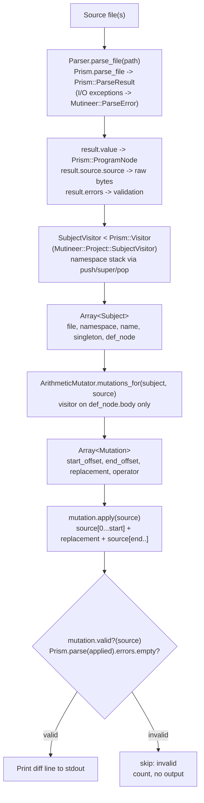

# M1 — Parse & Mutate (No Execution)

**Goal:** Wire Prism parsing, subject discovery with namespace tracking, and the arithmetic mutator so `mutineer run --dry-run <file>` prints candidate arithmetic mutations with correct locations — no forking, no test execution.

**Depends on:** M0 (gem skeleton, `bin/mutineer`, `cli.rb` optparse stub, `version.rb`, Gemfile, gemspec, Rakefile)
**Blocks:** M2 (end-to-end mutation run requires the Subject and Mutation objects built here)

---

## Locked Decisions (M1-Relevant)

| # | Decision | Impact on M1 |
|---|---|---|
| 1 | Ruby >= 3.4 only | `require "prism"` directly — Prism is bundled. No conditional gem wiring. No `prism` gem. |
| 2 | Default operators v1 = Tier 1 + statement-removal | M1 implements **arithmetic only**. Other operators land in M4. |
| 4 | Gem name: `mutineer` | Module namespace is `Mutineer` throughout. |
| Stack | Prism + stdlib only | No `unparser`. Mutations are textual byte-range substitutions (`String#[]`). |
| Stack | One mutation per mutant | Each `Mutation` object encodes exactly one atomic edit. Never combine. |
| Stack | Validity rule | Every mutated source string is re-parsed with Prism; parse errors discard silently, count as "skipped: invalid". |
| Stack | Mutations only inside body | Never on the `def` signature line. Enforced by visiting `def_node.body` only. |
| Clean-room | No `mutant` gem source | Implement from spec + public mutation-testing literature only. |

---

## Scope

### In
- `lib/mutineer/parser.rb` — Prism parse boundary (I/O exception wrapper)
- `lib/mutineer/subject.rb` — Subject value object
- `lib/mutineer/project.rb` — Subject discovery (DefNode walk, namespace stack, `--only` filter)
- `lib/mutineer/mutation.rb` — Mutation value object + instance-method `apply` + `valid?`
- `lib/mutineer/mutators/base.rb` — Mutator base class
- `lib/mutineer/mutators/arithmetic.rb` — Arithmetic operator (`+`<->`-`, `*`<->`/`, `%`->`*`, `**`->`*`)
- `lib/mutineer/cli.rb` — extend M0 stub: add `run --dry-run [--only NAME] <files>`
- `test/fixtures/calculator.rb` — arithmetic fixture (6 methods, one operator each)
- `test/mutators/arithmetic_test.rb` — unit test for the arithmetic mutator

### Out (deferred milestones)
- Fork isolation, child process, Minitest execution (M2)
- Coverage map and test-file selection (M3)
- Comparison, boolean connector, boolean literal operators (M4)
- Statement removal (M4)
- `--operators` toggle and operator registry (M4)
- Score aggregation and full reporter (M4)
- Config file `.mutineer.yml` (M5)
- Parallel worker pool (M5)
- Surgical method redefinition via `class_eval` (M5)

---

## High-Level Technical Design

M1 data flow (no execution, dry-run only):



### Namespace stack during subject discovery

```
source:                         namespace_stack at DefNode visit:

class Billing                   # push "Billing"        -> ["Billing"]
  module Invoice                # push "Invoice"        -> ["Billing", "Invoice"]
    def total                   # snapshot ["Billing", "Invoice"], singleton=false
    def self.build              # snapshot ["Billing", "Invoice"], singleton=true
  end                           # pop "Invoice"         -> ["Billing"]
end                             # pop "Billing"         -> []
```

`visit_class_node` and `visit_module_node` push the constant name, call `super` (visits children), then pop. `visit_def_node` snapshots `@namespace_stack.dup` at visit time.

### Arithmetic replacements

| Source token | `CallNode#name` | Replacement | Direction |
|---|---|---|---|
| `+` | `:+` | `"-"` | bidirectional half |
| `-` | `:-` | `"+"` | bidirectional half |
| `*` | `:*` | `"/"` | bidirectional half |
| `/` | `:/` | `"*"` | bidirectional half |
| `%` | `:%` | `"*"` | one-way |
| `**` | `:**` | `"*"` | one-way |

Each row produces exactly one `Mutation` object per occurrence.

---

## Implementation Units

### U1. Prism parser wrapper

**Goal:** I/O-exception boundary around Prism; both parse methods return `Prism::ParseResult` so all callers access `.value`, `.source.source`, and `.errors` uniformly — no custom struct.

**Files:**
- `lib/mutineer/parser.rb`

**Approach:**
- `Mutineer::Parser.parse_file(path)` -> `Prism::ParseResult`. Calls `Prism.parse_file(path)`. I/O failures (e.g., `Errno::ENOENT`) are caught and re-raised as `Mutineer::ParseError < StandardError`. Prism syntax errors are in-band via `result.errors` — never raised. Returns the `Prism::ParseResult` directly.
- `Mutineer::Parser.parse_string(source)` -> `Prism::ParseResult`. Wraps `Prism.parse(source)`. No exceptions raised. Used by the validity rule; callers check `.errors.empty?`.
- Both methods return the same type. No wrapping struct. Callers use `result.value` (AST root), `result.source.source` (raw bytes), `result.errors` directly.
- `Mutineer::ParseError < StandardError` — defined here, one line. Only raised for I/O failures.

**Key Prism APIs:**
- `Prism.parse_file(path)` -> `Prism::ParseResult`
- `Prism.parse(source_string)` -> `Prism::ParseResult`
- `result.value` -> `Prism::ProgramNode` (the AST root)
- `result.source.source` -> String (raw source bytes)
- `result.errors` -> `Array<Prism::ParseError>` (empty on clean parse)

**Test scenarios:**
- `parse_file` on a valid `.rb` file: returns `Prism::ParseResult`; `result.errors` is empty; `result.value` is a `Prism::ProgramNode`.
- `parse_file` on a file with syntax errors: returns `Prism::ParseResult` with non-empty `.errors`; does not raise.
- `parse_file` on a missing file: raises `Mutineer::ParseError`.
- `parse_string` on a valid snippet: `result.errors` is empty.
- `parse_string` on `"def foo"` (unclosed): `result.errors` is non-empty.

**Verification:** Assertions against `test/fixtures/calculator.rb`, a synthetic invalid string, and a missing path.

---

### U2. Mutation value object, apply, and validity

**Goal:** Immutable record for one byte-range edit; instance-method `apply` does the substitution; `valid?` enforces the validity rule.

**Files:**
- `lib/mutineer/mutation.rb`

**Approach:**
- `Mutineer::Mutation = Data.define(:start_offset, :end_offset, :replacement, :operator)` — four fields, immutable, Ruby 3.2+ `Data` (available in 3.4).
  - `start_offset`: Integer, byte offset of first byte to replace
  - `end_offset`: Integer, byte offset one past the last byte to replace
  - `replacement`: String, the new token text
  - `operator`: Symbol, the operator family name (`:arithmetic` for M1)
- `#apply(source)` (instance method): `source[0...start_offset] + replacement + source[end_offset..]`. Pure function; does not mutate `source`.
- `#valid?(source)` (instance method): calls `Mutineer::Parser.parse_string(apply(source))`, returns `true` iff `.errors.empty?`. Composes with `#apply`; no class-level helpers.

**Key APIs:** `Data.define` (Ruby stdlib 3.2+), `String#[]` with integer ranges.

**Test scenarios:**
- `mutation.apply(source)`: characters before `start_offset` unchanged; characters from `end_offset` onward unchanged; replacement occupies the middle.
- `mutation.apply(source)` is pure: original string not modified.
- `mutation.valid?(source)` on an arithmetic mutation (e.g., `+` -> `-`): returns `true`.
- `mutation.valid?(source)` with a deliberately broken replacement (e.g., `replacement: "("`): returns `false`.
- `Mutation` fields are immutable: `mutation.replacement = "x"` raises `FrozenError` or `NoMethodError`.

**Verification:** Unit assertions in `test/mutation_test.rb`.

---

### U3. Subject value object

**Goal:** Lightweight record identifying one discoverable method — its source location, namespace context, and the Prism DefNode needed by mutators to walk the body.

**Files:**
- `lib/mutineer/subject.rb`

**Approach:**
- `Mutineer::Subject = Struct.new(:file, :namespace, :name, :singleton, :def_node, keyword_init: true)`. Struct (not `Data.define`) because `def_node` is a live `Prism::DefNode`; `Data#==` would fall back to object identity for the node, making value-equality hollow. Struct avoids the false-immutability promise.
  - `file`: String, path to the source file
  - `namespace`: `Array<String>`, e.g., `["Billing", "Invoice"]` (empty for top-level)
  - `name`: Symbol (the method name)
  - `singleton`: Boolean
  - `def_node`: `Prism::DefNode` (raw AST node; enables mutators to call `def_node.body&.accept(visitor)`)
- `#qualified_name` -> `namespace.join("::") + (singleton ? "." : "#") + name.to_s`
  - Example: `"Billing::Invoice#total"`, `"Billing::Invoice.build"`
  - Top-level (empty namespace): `"#method_name"` (no `::` prefix; document this convention)
- `#body_loc` -> `def_node.body&.location` — nil for empty methods.

**Test scenarios:**
- `qualified_name` for instance method with two-level namespace -> `"Billing::Invoice#total"`.
- `qualified_name` for singleton method -> `"Billing::Invoice.build"`.
- `qualified_name` for top-level method (empty namespace) -> `"#method_name"`.
- `body_loc` returns nil for `def empty; end`.

**Verification:** Constructed directly in `test/subject_test.rb` using a parsed DefNode from a fixture snippet.

---

### U4. Subject discovery

**Goal:** Walk a parsed AST, maintain a namespace context stack, emit `Subject` records, and apply the `--only` filter.

**Files:**
- `lib/mutineer/project.rb`

**Approach:**
- `Mutineer::Project.discover(paths, only: nil)` -> `Array<Subject>`. Public API for M1 CLI.
- `Mutineer::Project::SubjectVisitor < Prism::Visitor` (nested class inside `Project`, enforcing its "private" status):
  - `initialize(file_path)`: sets `@namespace_stack = []`, `@subjects = []`, `@file = file_path`.
  - `visit_class_node(node)`: extract constant name from `node.constant_path` (see below); push onto `@namespace_stack`; call `super` (descends into body); pop.
  - `visit_module_node(node)`: same pattern.
  - `visit_def_node(node)`: snapshot `@namespace_stack.dup`; detect singleton via `node.receiver` (non-nil = singleton); create `Subject`; push to `@subjects`; call `super` (catches nested class/module/def inside method bodies — unusual but harmless).
  - `extract_constant_name(node)` (private): `ConstantReadNode` -> `node.name.to_s`; `ConstantPathNode` -> `[extract_constant_name(node.parent), node.name.to_s].compact.join("::")`. Handles both `class Foo` and `class Foo::Bar`.
- `discover` iterates `paths`, calls `Mutineer::Parser.parse_file` (getting `Prism::ParseResult`), runs `SubjectVisitor#visit(result.value)`, collects subjects, applies `only` filter (string equality on `#qualified_name`).

**Key Prism APIs:**
- `Prism::Visitor` (base class; `require "prism"`)
- `Prism::DefNode#name` (Symbol), `#receiver` (Node or nil), `#body`, `#location`
- `Prism::ClassNode#constant_path`, `#body`
- `Prism::ModuleNode#constant_path`, `#body`
- `Prism::ConstantReadNode#name` (Symbol)
- `Prism::ConstantPathNode#parent` (Node or nil), `#name` (Symbol — right-hand component)
- `node.accept(visitor)` / `super` in visitor methods

**Patterns to follow:** Standard `Prism::Visitor` subclass; push-before-super/pop-after-super for scope tracking.

**Test scenarios:**
- `discover` on a file with one class and two instance methods -> 2 Subjects with correct namespace and names, `singleton: false`.
- `discover` on `def self.foo` -> `singleton: true`.
- Nested classes (`class Outer; class Inner; def m; end; end; end`) -> 1 Subject with `namespace: ["Outer", "Inner"]`.
- Module-wrapped class (`module M; class C; def m; end; end; end`) -> `namespace: ["M", "C"]`.
- `only: "Calculator#add"` -> exactly 1 Subject matching `add`.
- `only: "UnknownClass#foo"` -> empty array, no error.
- Empty file -> empty array.
- `discover(["test/fixtures/calculator.rb"])` -> exactly 6 Subjects.

**Verification:** `Mutineer::Project.discover(["test/fixtures/calculator.rb"])` returns exactly 6 Subjects.

---

### U5. Arithmetic mutator

**Goal:** Prism visitor that walks one subject's body and emits `Mutation` objects for every arithmetic operator token, strictly inside the body.

**Files:**
- `lib/mutineer/mutators/base.rb`
- `lib/mutineer/mutators/arithmetic.rb`

**Approach:**

`Mutineer::Mutators::Base < Prism::Visitor`:
- `mutations_for(subject, source)`: initialises `@source = source`, `@mutations = []`; calls `subject.def_node.body&.accept(self)`; returns `@mutations`. The `.body&.accept` call is the body-only enforcement — visiting only the body node naturally excludes the `def` signature line.
- Subclasses override `visit_*` methods to push to `@mutations`.
- ponytail: one implementor in M1; Base earns its keep at M4 when comparison/boolean operators land and share this contract.

`Mutineer::Mutators::Arithmetic < Mutineer::Mutators::Base`:
- `REPLACEMENTS` constant (frozen Hash, String values):
  ```
  { :+ => "-", :- => "+", :* => "/", :/ => "*", :% => "*", :** => "*" }
  ```
  Scalar Strings, not Arrays. One replacement per operator. `Array()` wrapping at the call site if a multi-replacement operator is ever added.
- `mutations_for(subject, source)`: calls `super` (which calls `body&.accept(self)`); returns `@mutations`.
- `visit_call_node(node)`:
  - Return early if `REPLACEMENTS[node.name].nil?` or `node.message_loc.nil?`.
  - Push `Mutation.new(start_offset: node.message_loc.start_offset, end_offset: node.message_loc.end_offset, replacement: REPLACEMENTS[node.name], operator: :arithmetic)`.
  - Call `super` (so nested calls like `a + (b * c)` each get their own mutations).

**Key Prism APIs:**
- `Prism::Visitor` (inherited via Base)
- `Prism::CallNode#name` — Symbol (`:+`, `:-`, `:*`, `:/`, `:%`, `:**`)
- `Prism::CallNode#message_loc` — `Prism::Location` with `#start_offset`, `#end_offset`, `#slice`
- `def_node.body&.accept(self)` — restricts visitation to the method body

**Test scenarios (`test/mutators/arithmetic_test.rb`):**
- A method containing `a + b` -> 1 mutation; `source[m.start_offset...m.end_offset]` equals `"+"` and `m.replacement` equals `"-"`.
- `a - b` -> 1 mutation replacing with `"+"`.
- `a * b` -> 1 mutation replacing with `"/"`.
- `a / b` -> 1 mutation replacing with `"*"`.
- `a % b` -> 1 mutation replacing with `"*"`.
- `a ** b` -> 1 mutation replacing with `"*"`.
- `a + (b * c)` -> 2 mutations (one for each operator, nested correctly via `super`).
- Method with no arithmetic operators -> 0 mutations.
- Empty method body -> 0 mutations, no crash.
- `m.operator` is `:arithmetic` for all emitted mutations.
- `source[m.start_offset...m.end_offset]` equals the original operator text (offset accuracy check).

**Verification:** `ruby -Ilib test/mutators/arithmetic_test.rb` exits 0, all assertions pass.

---

### U6. Calculator fixture

**Goal:** Minimal source file with exactly one arithmetic operator per method, giving 6 hand-verifiable mutations for the acceptance gate.

**Files:**
- `test/fixtures/calculator.rb`

**Approach:**

```ruby
# test/fixtures/calculator.rb
class Calculator
  def add(a, b)
    a + b
  end

  def subtract(a, b)
    a - b
  end

  def multiply(a, b)
    a * b
  end

  def divide(a, b)
    a / b
  end

  def modulo(a, b)
    a % b
  end

  def power(a, b)
    a ** b
  end
end
```

Six methods, one arithmetic operator each. Expected dry-run output: 6 mutation lines. Regular `def/end` syntax (not endless defs) keeps the operator on a separate line from the signature — unambiguous line-number verification and avoids `DefNode#body` edge cases between endless and regular defs.

**Test expectation:** none — this is a data fixture.

---

### U7. CLI dry-run command

**Goal:** Wire `mutineer run --dry-run [--only NAME] <file...>` in the M0 CLI stub; print one line per valid mutation to stdout; errors to stderr; non-zero exit on error conditions.

**Files:**
- `lib/mutineer/cli.rb` (extend M0 stub — add `run` subcommand)
- `lib/mutineer.rb` (add requires for new M1 files)

**Approach:**
- M0's `cli.rb` has `optparse` wiring for `--version`. M1 adds a `run` subcommand recognising `--dry-run` and `--only NAME`.
- **Exit codes:** 0 = success (mutations printed, even if 0); 1 = error (no files given, file not found, unexpected exception). The "not yet implemented" placeholder also exits 1 so CI fails fast.
- **stdout / stderr separation:** mutation lines and summary go to `$stdout`; error messages go to `$stderr`. No mixing.
- When `--dry-run`:
  1. If no file arguments: print usage hint to `$stderr`, exit 1.
  2. `Mutineer::Project.discover(files, only: opts[:only])` -> subjects. Catch `Mutineer::ParseError`: print `"mutineer: error reading <path>: <message>"` to `$stderr`, exit 1.
  3. For each subject, run `ArithmeticMutator.new.mutations_for(subject, source)` (source from `result.source.source` held after discovery).
  4. For each mutation: `mutation.valid?(source)`; skip if false; else print one line to `$stdout`.
  5. Print summary to `$stdout`: `"Dry-run: N mutations found, K skipped (invalid)"`.
- Output format per mutation (ASCII only, no ANSI, no Unicode arrows):
  ```
  [arithmetic] Calculator#add  test/fixtures/calculator.rb:3  `+` -> `-`
  ```
  Fields: `[operator]`, qualified subject name, `file:line`, `` `original` -> `replacement` ``. Uses `->` (two ASCII chars) not `->` Unicode arrow.
- Line number from offset: private helper counting `\n` chars in `source[0...mutation.start_offset]` plus 1. Stdlib only.
- Without `--dry-run`: print `"run requires --dry-run; execution not yet implemented"` to `$stderr`, exit 1.

**Test scenarios:**
- `ruby -Ilib bin/mutineer run --dry-run test/fixtures/calculator.rb` prints exactly 6 mutation lines to stdout, exits 0.
- Each line names the correct subject and replacement pair using `->`.
- `--only Calculator#add` produces exactly 1 mutation line, exits 0.
- `--only UnknownClass#foo` produces 0 mutation lines, exits 0 (no subjects matched is a valid empty result, not an error).
- No file arguments: prints usage hint to stderr, exits 1.
- File not found: prints error to stderr, exits 1.
- Without `--dry-run`: prints "not yet implemented" to stderr, exits 1.
- `--version` still works and exits 0 (regression from M0).

**Verification:** Execute the commands above from the repo root; verify exit codes with `echo $?`; verify stdout/stderr split with redirection.

---

## Acceptance Gate

Run from the repo root after M0 skeleton is in place:

```bash
# 1. Unit test — arithmetic mutator
ruby -Ilib test/mutators/arithmetic_test.rb

# 2. CLI dry-run against the fixture
ruby -Ilib bin/mutineer run --dry-run test/fixtures/calculator.rb
echo "Exit: $?"  # must be 0

# 3. --only filter
ruby -Ilib bin/mutineer run --dry-run --only Calculator#add test/fixtures/calculator.rb

# 4. Error state: no files
ruby -Ilib bin/mutineer run --dry-run 2>&1; echo "Exit: $?"  # must be 1

# 5. Load check (requires M0 to wire lib/mutineer.rb)
ruby -Ilib -e 'require "mutineer"; puts "load ok"'
```

**Expected for step 2** — exactly 6 lines to stdout, one per arithmetic method:
```
[arithmetic] Calculator#add       test/fixtures/calculator.rb:3  `+` -> `-`
[arithmetic] Calculator#subtract  test/fixtures/calculator.rb:8  `-` -> `+`
[arithmetic] Calculator#multiply  test/fixtures/calculator.rb:13 `*` -> `/`
[arithmetic] Calculator#divide    test/fixtures/calculator.rb:18 `/` -> `*`
[arithmetic] Calculator#modulo    test/fixtures/calculator.rb:23 `%` -> `*`
[arithmetic] Calculator#power     test/fixtures/calculator.rb:28 `**` -> `*`
Dry-run: 6 mutations found, 0 skipped (invalid)
```

Verify by hand: 6 mutation lines; `->` ASCII arrows (not Unicode); operator tokens and replacements match the table in the HTD section; line numbers align with the fixture (operator is on the third line of each 4-line method block, plus blank separators).

**Expected for step 3:** exactly 1 line (`Calculator#add`), exits 0.
**Expected for step 4:** error message on stderr, exits 1.

---

## Open Questions

None blocking M1. Deferred:

- **Top-level method `qualified_name` convention:** empty namespace -> `"#name"` or just `"name"`? Decide at M3 when coverage map keying makes the choice load-bearing.
- **`ConstantPathNode` API across Ruby 3.4.x minor versions:** confirm `#parent` and `#name` are stable. Verify with `ruby -e 'require "prism"; pp Prism::ConstantPathNode.instance_methods(false)'` on the target Ruby.

---

## Risks & Dependencies

| Risk | Likelihood | Mitigation |
|---|---|---|
| `Prism::ConstantPathNode` API differs between Ruby 3.4 patch releases | Low | Inspect instance methods at setup time; use `#name` with `#parent` traversal (confirmed in Prism 1.x). |
| `CallNode#message_loc` is nil for some operator-style calls | Low | Guard: only emit mutation when `node.message_loc` is non-nil (one early return in `visit_call_node`). |
| `DefNode#body` type differs for endless defs vs regular defs | Low | Avoided by using regular `def/end` in the calculator fixture. Future fixtures: endless def body is the expression node directly — still works with `body&.accept`. |
| M0 skeleton not present when M1 is worked | Certain (M0 first) | M1 is blocked on M0. Dependency is explicit. |

---

## Validation

Validated with `intent-engineering:ie-validate-plan` (run ID: 20260628-d60dede9).

**Dimensional ratings (post-gap-resolution):**

| Lens | Dimension | Pre-fix Score | Gap resolved |
|---|---|---|---|
| experience | interaction_state_coverage | 3/10 | U7: exit codes, stderr/stdout split, no-files error, file-not-found scenario added |
| experience | look_and_feel_consistency | 4/10 | U7: `->` (ASCII) replaces `->` Unicode; `[M1]` tag removed from user strings; exit 1 on errors |
| experience | user_flow_completeness | 5/10 | U7: error-path test scenarios added (file not found, no files, syntax error) |
| simplicity | essential_vs_accidental_complexity | 5/10 | U1: custom struct eliminated; both parse methods return `Prism::ParseResult` directly |
| simplicity | abstraction_earns_its_keep | 5/10 | U5: REPLACEMENTS values are now Strings (not Arrays); Base kept per spec §12 with ponytail comment |
| convention | framework_idiom | 5/10 | U2: `apply` and `valid?` are now instance methods (`mutation.apply(source)`, `mutation.valid?(source)`) |
| predictability | return_contract_consistency | 5/10 | U1: both `parse_file` and `parse_string` return `Prism::ParseResult` — consistent type |
| predictability | failure_transparency | 5/10 | U1: syntax errors reachable via `result.errors`; U7: ParseError caught, printed to stderr, exits 1 |
| convention | repo_consistency | 7/10 | U4: `SubjectVisitor` renamed to `Mutineer::Project::SubjectVisitor` (nested, enforces private intent) |
| convention | framework_idiom (def_node) | — | U3: `Data.define` -> `Struct` with keyword_init (def_node makes pure value semantics hollow) |

**Unresolved gaps:** none. All P1 and P2 findings resolved. P3 (Base YAGNI tension) acknowledged with ponytail comment.

**Validator verdict (pre-fix):** Revise first — 5 P1 findings. **Post-fix verdict: Ready to implement.**

Report artifact: `wip/intent-engineering/20260628-d60dede9/report.md`

---

## Definition of Done

- `ruby -Ilib test/mutators/arithmetic_test.rb` exits 0, all assertions pass.
- `ruby -Ilib bin/mutineer run --dry-run test/fixtures/calculator.rb` prints exactly 6 arithmetic mutation lines to stdout using `->` (ASCII), exits 0.
- `ruby -Ilib bin/mutineer run --dry-run --only Calculator#add test/fixtures/calculator.rb` prints exactly 1 line, exits 0.
- `ruby -Ilib bin/mutineer run --dry-run` (no files) prints a usage hint to stderr, exits 1.
- `ruby -Ilib -e 'require "mutineer"'` exits 0.
- No runtime gem dependency beyond Ruby 3.4 stdlib.
- `Prism::CallNode#message_loc` nil-guarded in the arithmetic mutator.
- Validity rule exercised in unit tests (at least one `mutation.valid?(source)` -> false scenario).
