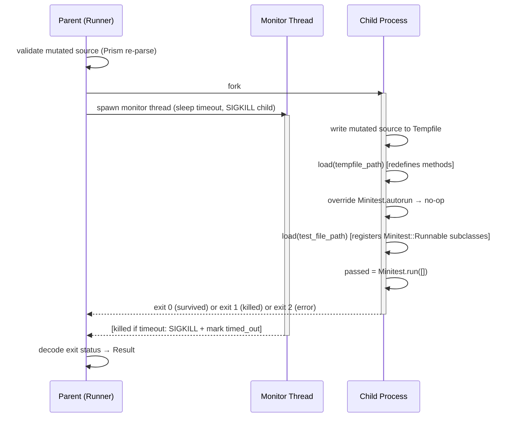
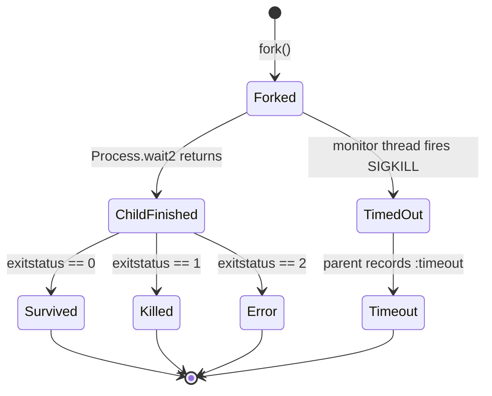

# M2 — End-to-End, One Mutant - Plan

---

## Goal Capsule

- **Objective:** Prove a single arithmetic mutation runs end-to-end through fork isolation, whole-file reload, and Minitest execution — producing a verified `killed` result against a strong test and a verified `survived` result against a weak test.
- **Authority:** Spec §7a, §9, §11 (M2); locked decisions in `docs/plans/_DECISIONS.md`.
- **Stop conditions:** Stop and flag if the fork/timeout mechanism cannot reliably terminate an infinite-looping child, or if Minitest's result value (`true`/`false`) proves unreliable across the outcome cases below. Do not proceed to the acceptance gate with a flaky isolation layer.
- **Execution profile:** Standard — 6 implementation units, dependency-ordered.
- **Depends on:** M1 (parse & mutate, `Mutineer::Mutation`, `Mutineer::Subject`, arithmetic operator, subject discovery).
- **Blocks:** M3 (coverage map + selection, which hands the runner a list of covering test files instead of a hardcoded one).

---

## Product Contract

### Summary

M2 closes the first end-to-end loop: a `Mutineer::Mutation` object (produced by M1's arithmetic operator) travels through a forked child process, is applied to a Tempfile via whole-file reload, executes against a Minitest file, and returns one of four typed outcomes — `killed`, `survived`, `error`, or `timeout`. The milestone is verified by two acceptance scenarios on the calculator fixture: the same mutation is killed by a comprehensive test and survives a deliberately weak one.

### Problem Frame

M1 proved that Mutineer can parse Ruby source and generate `Mutation` objects with precise byte offsets. M2 proves those mutations can actually run: the child process applies them without corrupting the parent, Minitest is invoked and controlled programmatically, and the outcome is encoded and decoded unambiguously. Without this layer, all of M3–M5 have no execution substrate.

### Requirements

**Isolation and fork**
- R1. The runner forks a child process per mutation; the parent and child share no mutable state after the fork.
- R2. The parent enforces a wall-clock timeout; when the child exceeds it the parent sends `SIGKILL`, reaps the process, and records `timeout`.
- R3. `timeout` is treated as equivalent to `killed` for scoring purposes but is tagged distinctly in the result so the report can surface it separately.

**Mutation application (strategy 7a)**
- R4. The child writes the mutated source to a `Tempfile`, then calls `load` on that path to redefine the methods in place.
- R5. The parent `require`s the application file before forking so the test file's own `require` is a no-op (already in `$LOADED_FEATURES`); the mutation is not clobbered.
- R6. The 7a side-effect limitation — top-level code in the file re-runs on `load` — is documented in `isolation.rb` with a `# mutineer:` comment.
- R7. After building the mutated source string, the parent re-parses it with Prism before forking; parse errors return `Result.skipped` immediately, with no child process spawned.

**Minitest control**
- R8. The child overrides `Minitest.autorun` to a no-op before loading any test file, preventing the `at_exit` registration.
- R9. The child invokes `Minitest.run([])` explicitly after loading the test file(s).
- R10. Any test failure or error maps to `killed` (exit status 1); a clean pass maps to `survived` (exit status 0); an unhandled exception in setup or mutation-apply maps to `error` (exit status 2).

**Result value object**
- R11. `Mutineer::Result` encodes five states: `killed`, `survived`, `error`, `timeout`, `skipped`. Each state is queryable via a predicate method (`killed?`, `survived?`, `error?`, `timeout?`, `skipped?`).
- R12. The exit-status-to-result mapping is unambiguous: 0 → survived, 1 → killed, 2 → error; timeout is detected by the parent (boolean flag) before reading the exit status; skipped is produced by the parent before forking (Prism parse failure) and has no exit status.

**Fixtures and acceptance gate**
- R13. `test/fixtures/calculator.rb` contains a `Calculator` class with an `add` method using `+` (and at least one other arithmetic method).
- R14. `test/fixtures/calculator_strong_test.rb` tests `add` with non-symmetric inputs so the `+` → `-` mutation changes the result and is caught.
- R15. `test/fixtures/calculator_weak_test.rb` tests `add` only with inputs where `+` and `-` produce the same value (e.g., `add(0, 0)`), so the mutation survives.
- R16. `test/runner_test.rb` constructs a `Mutation` manually with known byte offsets and asserts `killed?` against the strong test and `survived?` against the weak test.

### Scope Boundaries

**In scope for M2:**
- `lib/mutineer/result.rb`, `lib/mutineer/isolation.rb`, `lib/mutineer/minitest_integration.rb`, `lib/mutineer/runner.rb`
- `test/fixtures/calculator.rb`, `test/fixtures/calculator_strong_test.rb`, `test/fixtures/calculator_weak_test.rb`
- `test/runner_test.rb`

**Deferred to Follow-Up Work (M3+):**
- Coverage map: M3 selects covering test files automatically; M2 takes a single test file path as an explicit argument.
- Full mutation loop over all subjects: M4.
- Multiple operators beyond arithmetic: M4.
- Parallel worker pool: M5.
- Reporter (score, survivor diffs): M4.
- Surgical method redefinition (strategy 7b): M5.

**Outside scope entirely:**
- Windows support (fork-based; per locked decisions).
- RSpec integration.
- Equivalent-mutant detection.
- `--since` incremental mode.

---

## Planning Contract

### Key Technical Decisions

KTD1. **Exit status encoding (0/1/2; timeout via parent flag; skipped pre-fork)**
The child exits with status 0 (survived), 1 (killed), or 2 (error). The parent detects timeout via a boolean flag set by the monitor thread — not via `status.signaled?`, which is true for any signal (SIGSEGV, SIGTERM) not just the monitor's SIGKILL. Mutations that fail Prism re-parse are returned as `Result.skipped` from the parent before forking, with no child process spawned. This keeps each outcome unambiguously sourced: child exit status → killed/survived/error; parent flag → timeout; parent pre-fork → skipped.

KTD2. **Timeout mechanism: monitor thread with boolean flag**
The parent spawns a `Thread` that sleeps for the timeout duration, sets `timed_out = true`, then sends `SIGKILL` to the child PID. The main thread calls `Process.wait2(pid)` (blocking). When `wait2` returns, the monitor thread is killed unconditionally, and the parent checks `timed_out` — not `status.signaled?` — to decide whether to return `Result.timeout`. This correctly distinguishes "we killed it" from "the OS killed it" (SIGSEGV, SIGBUS etc.), which `status.signaled?` cannot distinguish. This approach is simpler than `SIGALRM` (requires signal handling in the child) and more reliable than `RLIMIT_CPU` (CPU time, not wall clock).

KTD3. **Minitest autorun suppression: override before load**
Before loading any test file, the child redefines `Minitest.autorun` to a no-op. Test files that call `require 'minitest/autorun'` trigger the `autorun` method, which now does nothing instead of registering an `at_exit`. After all test files are loaded, `Minitest.run([])` is called explicitly. The return value (`true` = all passed; `false` = any failure/error) drives the exit status. This is the minimum-friction approach — it does not monkey-patch `at_exit` itself or clear `Minitest::Runnable.runnables`, which could affect future M-series work.

KTD4. **Parent pre-require locks the require chain**
The parent calls `require` on the application file (e.g., `lib/mutineer.rb` or the target file directly) before forking. After the fork, `$LOADED_FEATURES` in the child already includes the app file, so the test file's `require` is a no-op. The child then calls `load` (not `require`) on the Tempfile containing the mutated source. `load` always re-executes the file, reopening classes and redefining methods. This is why `require` (no-op on second call) and `load` (always runs) serve different roles here.

KTD5. **Validity check before fork**
The mutated source string is re-parsed with Prism in the parent, before forking. If Prism reports any parse errors, the mutation is discarded as `skipped: invalid` and no fork is attempted. Cost: one Prism parse per mutation candidate — negligible at M2 scale where a single mutation is exercised.

KTD6. **Hardcoded test file in M2 runner; coverage selection is M3**
`Runner#run` takes `(mutation, test_file:)` as arguments. The runner test hardcodes the fixture paths. M3 replaces the explicit `test_file:` argument with a `coverage_map` lookup. This boundary is clean: the runner does not need to know about coverage at this stage.

KTD7. **Mutation object shape (from M1)**
M2 consumes `Mutineer::Mutation` with at minimum: `file` (String, path to the source file), `start_offset` (Integer, byte offset of the token start), `end_offset` (Integer, byte offset of the token end), and `replacement` (String). The runner test constructs one manually without invoking the parser/mutator pipeline — this verifies the isolation/runner layer independently of M1's operator logic.

### Assumptions

- M1 has defined `Mutineer::Mutation` as a Struct or class with the four fields in KTD7. If the shape differs, adjust the manual construction in `test/runner_test.rb` accordingly.
- Minitest is available in the load path when Mutineer's test suite runs (it is a dev dependency per spec §3).
- `Process.fork` and `Process.kill` are available (Linux/macOS; per locked decisions, Windows is out of scope).
- The timeout default (10 seconds) is configurable as a constant in `isolation.rb`; M5 wires it to a CLI flag.

### High-Level Technical Design

**Fork/child lifecycle and outcome encoding:**



**Four-outcome state machine:**



**7a whole-file reload — why `require` + `load` coexist:**

```
Parent process:
  require "test/fixtures/calculator"   →  $LOADED_FEATURES << "…/calculator.rb"

  fork:
    Child process:
      Tempfile.create → writes mutated source
      load(tempfile.path)              →  reopens Calculator, redefines #add
      load("test/fixtures/calculator_strong_test.rb")
        ↳ require "test/fixtures/calculator" inside test file → NO-OP (already loaded)
      Minitest.run([]) → tests run against the mutated #add
```

---

## Implementation Units

### U1. Calculator fixture files

**Goal:** Provide the three fixture files that serve as the acceptance gate for M2 and regression fixtures for M3–M5.

**Requirements:** R13, R14, R15.

**Dependencies:** None.

**Files:**
- `test/fixtures/calculator.rb` (create)
- `test/fixtures/calculator_strong_test.rb` (create)
- `test/fixtures/calculator_weak_test.rb` (create)

**Approach:** `Calculator` exposes `add`, `subtract`, `multiply`, and `divide`. The demo mutation is `+` → `-` in `add`. The strong test calls `add(2, 3)` and asserts `5` — the mutation produces `-1`, which is caught. The weak test calls `add(0, 0)` and asserts `0` — the mutation produces `0`, which passes unchanged. Both test files use `require 'minitest/autorun'` so they work standalone; the runner will suppress that `at_exit` registration when running them in the child.

**Test scenarios:**
- Verify `test/fixtures/calculator_strong_test.rb` passes standalone with `ruby -Itest test/fixtures/calculator_strong_test.rb`.
- Verify `test/fixtures/calculator_weak_test.rb` passes standalone.
- Manually confirm: `Calculator.new.add(2, 3)` with `+` → `-` applied gives `-1`; strong test catches it.
- Manually confirm: `Calculator.new.add(0, 0)` with `+` → `-` applied gives `0`; weak test passes.

**Verification:** Both files pass `ruby -Itest test/fixtures/calculator_strong_test.rb` and the weak variant. Output confirms non-zero assertion counts (not a vacuous empty test run).

---

### U2. `Mutineer::Result` value object

**Goal:** Provide an immutable value object encoding the four mutation outcomes with factory methods and predicate queries.

**Requirements:** R11, R12.

**Dependencies:** None.

**Files:**
- `lib/mutineer/result.rb` (create)
- `test/result_test.rb` (create)

**Approach:** Use `Struct.new(:status, :details)` with factory class methods (`Result.killed`, `Result.survived`, `Result.error(msg = nil)`, `Result.timeout`, `Result.skipped`) and predicate instance methods (`killed?`, `survived?`, `error?`, `timeout?`, `skipped?`). The `details` field carries an optional string for error messages or skip reasons; it is `nil` for `killed`, `survived`, and `timeout`. Keep the struct frozen after construction — results are never mutated. `Result.skipped` is the pre-fork validity failure state (Prism parse error); `Result.error` is the runtime failure state (child crash). These are distinct types — do not conflate them via `details` string parsing.

**Test scenarios:**
- `Result.killed.killed?` returns `true`; `killed.survived?` returns `false`.
- `Result.survived.survived?` returns `true`.
- `Result.error("oops").error?` returns `true`; `error.details` returns `"oops"`.
- `Result.timeout.timeout?` returns `true`.
- `Result.skipped.skipped?` returns `true`; `skipped.details` is `nil`.
- Each factory produces a distinct `status` symbol; no two factories share a value.
- `Result.error` with no argument: `details` is `nil` (not raised).
- `Result.skipped.error?` returns `false` (skipped and error are distinct states).

**Verification:** `ruby -Ilib test/result_test.rb` passes with six assertions.

---

### U3. `Mutineer::Isolation` — fork worker with timeout

**Goal:** Fork a child, run a provided block inside it, enforce a wall-clock timeout, and decode the child's exit status into a `Result`.

**Requirements:** R1, R2, R3, R5, R7.

**Dependencies:** U2 (`Mutineer::Result`).

**Files:**
- `lib/mutineer/isolation.rb` (create)
- `test/isolation_test.rb` (create)

**Approach:**
- `Isolation.run(timeout: DEFAULT_TIMEOUT, &block)` — forks, runs block in child, parent decodes.
- `DEFAULT_TIMEOUT = 10` (seconds) as a named constant; easy to override in tests via the keyword argument.
- The child wraps the block in a `rescue Exception` block; before calling `exit(2)`, it writes the exception details to STDERR with a `[mutineer-child]` prefix (`$stderr.puts "[mutineer-child] #{e.class}: #{e.message}"`) so the parent's log output captures the root cause without IPC.
- The parent sets `timed_out = false` (local variable), spawns `Thread.new { sleep timeout; timed_out = true; Process.kill(:KILL, pid) rescue nil }`, then calls `Process.wait2(pid)` (blocking).
- After `wait2` returns, the monitor thread is killed unconditionally. Decode by checking `timed_out` (not `status.signaled?` — which is true for any signal, not just SIGKILL) first, then `status.exitstatus`.
- Decode: `timed_out` → `Result.timeout`; else `status.exitstatus` → 0=survived, 1=killed, 2=error.
- Document the 7a side-effect note inline: `# mutineer: load re-executes the entire file; any top-level code runs again. Acceptable for POROs; document if users report issues with initializers or callbacks. Upgrade path: M5 strategy 7b (class_eval surgical redefinition).`

**Technical design (directional):**
```ruby
# directional guidance — not implementation specification
module Mutineer
  class Isolation
    DEFAULT_TIMEOUT = 10

    def self.run(timeout: DEFAULT_TIMEOUT, &block)
      timed_out = false
      pid = fork do
        block.call
      rescue Exception => e
        $stderr.puts "[mutineer-child] #{e.class}: #{e.message}"
        exit(2)
      end
      monitor = Thread.new { sleep timeout; timed_out = true; Process.kill(:KILL, pid) rescue nil }
      _, status = Process.wait2(pid)
      monitor.kill
      decode(status, timed_out: timed_out)
    end

    def self.decode(status, timed_out:)
      return Result.timeout if timed_out
      case status.exitstatus
      when 0 then Result.survived
      when 1 then Result.killed
      when 2 then Result.error("child exited with status 2")
      else        Result.error("unexpected exit status: #{status.exitstatus}")
      end
    end
  end
end
```

**Test scenarios:**
- Block that exits 0 → `result.survived?`.
- Block that exits 1 → `result.killed?`.
- Block that exits 2 → `result.error?`.
- Block that `raise`s (unhandled in child) → `result.error?` (child's rescue Exception catches it, exits 2).
- Block that sleeps forever with `timeout: 1` → `result.timeout?` (test uses a 1s timeout to keep suite fast).
- Monitor thread is reaped regardless of which path fires (no zombie processes or leaked threads).

**Patterns to follow:** `Process.fork`, `Process.wait2`, `Process.kill`, `Thread.new` — all stdlib.

**Verification:** `ruby -Ilib test/isolation_test.rb` passes with five assertions; no zombie processes (confirm with `ps` in the test or via `Process.wait(-1, Process::WNOHANG)` returning nil after each test).

---

### U4. `Mutineer::MinitestIntegration` — programmatic test runner

**Goal:** Disable Minitest's autorun, load a test file in the current process, invoke the run explicitly, and return an exit status integer (0 or 1).

**Requirements:** R8, R9, R10.

**Dependencies:** U2 (result interpretation lives in `Isolation`, but `MinitestIntegration` only produces an integer exit status — it does not create `Result` objects).

**Files:**
- `lib/mutineer/minitest_integration.rb` (create)

**Approach:**
- `MinitestIntegration.run(test_file)` — returns an integer: 0 (all tests passed), 1 (any failure/error).
- Before loading the test file, redefine `Minitest.autorun` to a no-op. Require `minitest` first to ensure the module exists before redefining.
- Call `load(test_file)` (not `require` — the same test file may be loaded in multiple child processes; `require` would no-op on the second child in the same process tree).
- Call `passed = Minitest.run([])`. If `passed` is truthy → return 0; falsy → return 1.
- Do not add a `rescue Exception` clause here. `Isolation.run`'s fork block is the single exception boundary; duplicating a rescue in `MinitestIntegration` creates two exit-2 paths and contradicts the stated return contract of 0/1. Any exception propagates to `Isolation`'s rescue, which writes it to stderr and exits 2.

**Note:** `MinitestIntegration` is a child-process module only. It is never called in the parent. This must be enforced by the runner — never call it outside a fork block.

**Test scenarios:**
This module is exercised indirectly by U6 (the runner test). A direct unit test would require forking, which duplicates U3's coverage. Document this as a deliberate integration-only test choice: `# ponytail: tested via runner_test.rb (U6), not in isolation — a direct unit test would require forking and duplicate U3's coverage.`

**Verification:** Covered by U6 runner_test.rb passing both outcomes.

---

### U5. `Mutineer::Runner` — single-mutation orchestrator

**Goal:** Accept one `Mutation` and one test file path, validate the mutated source, apply it via 7a, run the test in isolation, and return a `Result`.

**Requirements:** R1–R10, R12 (all requirements flow through runner).

**Dependencies:** U2 (Result), U3 (Isolation), U4 (MinitestIntegration).

**Files:**
- `lib/mutineer/runner.rb` (create)

**Approach:**
- `Runner.run(mutation, test_file:, timeout: Isolation::DEFAULT_TIMEOUT)` → `Result`.
- Read the source file: `source = File.read(mutation.file)`.
- Apply the mutation textually: `mutated = source[0...mutation.start_offset] + mutation.replacement + source[mutation.end_offset..]`.
- Validate: `prism_result = Prism.parse(mutated); return Result.skipped if prism_result.errors.any?` (per KTD5, validity check before fork — returns `Result.skipped`, not `Result.error`, to preserve the distinct count the reporter needs).
- Fork via `Isolation.run(timeout:)`:
  ```
  write mutated source to Tempfile
  load(tempfile.path)         # 7a: redefine methods
  exit_status = MinitestIntegration.run(test_file)
  exit(exit_status)
  ```
- Return the `Result` from `Isolation.run`.

**Technical design (directional):**
```ruby
# directional guidance — not implementation specification
# require "tempfile" at top of this file (not inline in the fork block)
module Mutineer
  class Runner
    def self.run(mutation, test_file:, timeout: Isolation::DEFAULT_TIMEOUT)
      source = File.read(mutation.file)
      mutated = source[0...mutation.start_offset] +
                mutation.replacement +
                source[mutation.end_offset..]

      prism_result = Prism.parse(mutated)
      return Result.skipped if prism_result.errors.any?

      Isolation.run(timeout: timeout) do
        Tempfile.create(["mutineer_mutant", ".rb"]) do |f|
          f.write(mutated)
          f.flush
          load f.path
        end
        exit MinitestIntegration.run(test_file)
      end
    end
  end
end
```

**Test scenarios:** Covered by U6. Any exception during `File.read` (file not found) propagates to the caller naturally — the runner does not rescue it, since M2 controls both mutation and test file paths explicitly.

**Verification:** Covered by U6 runner_test.rb passing.

---

### U6. Runner test — acceptance gate

**Goal:** Assert both acceptance scenarios: the `+` → `-` mutation on `Calculator#add` is killed by the strong test and survives the weak test.

**Requirements:** R13–R16 (all fixture requirements).

**Dependencies:** U1 (fixtures), U2 (Result), U3 (Isolation), U4 (MinitestIntegration), U5 (Runner).

**Files:**
- `test/runner_test.rb` (create)

**Approach:**
- The test constructs a `Mutation` manually by reading `test/fixtures/calculator.rb`, finding the byte offset of the `+` operator in `add(a, b) = a + b` (or `a + b` inside the method body), and constructing `Mutineer::Mutation.new(file: ..., start_offset: ..., end_offset: ..., replacement: "-", ...)`.
- Do not hardcode byte offsets as magic numbers — derive them from the known fixture content at test time using `String#index` or `Prism.parse` to locate the operator. This makes the test robust to minor whitespace changes in the fixture.
- The parent test process must `require` the calculator fixture before constructing the runner (per KTD4/R5). Add `require_relative "../fixtures/calculator"` in the test setup.
- Call `Runner.run(mutation, test_file: "test/fixtures/calculator_strong_test.rb")` → assert `result.killed?`.
- Call `Runner.run(mutation, test_file: "test/fixtures/calculator_weak_test.rb")` → assert `result.survived?`.

**Execution note:** Run these tests last in the suite; each spawns a child process. The test runner must not share Minitest's `at_exit` state with the child. (This is automatically satisfied because the child is forked — it inherits a copy of the parent's state and then suppresses autorun independently.)

**Test scenarios:**
- `Runner.run(arithmetic_plus_mutation, test_file: strong_test_path).killed?` → `true`.
- `Runner.run(arithmetic_plus_mutation, test_file: weak_test_path).survived?` → `true`.
- Mutation with an invalid replacement (produces a syntax error after textual substitution) → `result.skipped?` (Prism re-parse failure, returned from parent before forking).
- Timeout case: mutation whose `load` triggers an infinite loop with `timeout: 2` → `result.timeout?`. Use a purpose-built fixture for this (`test/fixtures/infinite_loop_mutant.rb`) rather than a real calculator mutation — keeps the timeout test deterministic.

**Patterns to follow:** Same Minitest/Struct patterns as M1's test suite when it exists. Use `minitest/autorun` in the test file itself (Mutineer's test suite runs normally — only child processes suppress autorun).

**Verification:** `ruby -Ilib -Itest test/runner_test.rb` passes with four assertions. No test takes longer than the timeout value + 1 second (the timeout test uses `timeout: 2`). Confirm each assertion explicitly logs the result status on failure.

---

## Verification Contract

| Gate | Command | Expected |
|---|---|---|
| Fixtures standalone | `ruby -Itest test/fixtures/calculator_strong_test.rb` | All assertions pass |
| Fixtures standalone | `ruby -Itest test/fixtures/calculator_weak_test.rb` | All assertions pass |
| Result unit | `ruby -Ilib test/result_test.rb` | ≥ 6 assertions, 0 failures |
| Isolation unit | `ruby -Ilib test/isolation_test.rb` | ≥ 5 assertions, 0 failures, no zombies |
| Runner acceptance | `ruby -Ilib -Itest test/runner_test.rb` | 4 assertions, 0 failures |
| Full test suite | `ruby -Ilib -Itest -e 'Dir["test/**/*_test.rb"].each { require _1 }'` | 0 failures across all M1+M2 tests |
| Load check | `ruby -Ilib -e 'require "mutineer"; require "mutineer/result"; require "mutineer/isolation"; require "mutineer/runner"'` | No errors |

No Rake dependency assumed for M2; suite runner is a one-liner.

---

## Definition of Done

**Global:**
- All six verification gates above pass.
- `test/runner_test.rb` produces verified `killed?` and `survived?` for the same arithmetic mutation against the two fixture test files.
- No zombie processes (each forked child is reaped by `Process.wait2`).
- The 7a side-effect limitation is documented in `lib/mutineer/isolation.rb` with a `# mutineer:` comment.
- No code references or copies from the `mutant` gem source (clean-room constraint).
- All new files use `require "prism"` (not `gem "prism"`) — Ruby 3.4+ bundled per locked decision.

**Per unit:**
- U1: both fixture files pass standalone; weak test verifiable demonstrates a survived mutation manually.
- U2: `result_test.rb` passes; all four factory methods and four predicates exercised.
- U3: `isolation_test.rb` passes; timeout scenario completes in ≤ 3 seconds.
- U4: No direct test file required; covered by U6.
- U5: No direct test file required; covered by U6.
- U6: `runner_test.rb` passes all four scenarios including the timeout case.

**Cleanup:** Remove any debug `puts` or temporary test scripts introduced during implementation. Confirm no `binding.pry` or `byebug` calls remain.

---

## Validation

**Validator:** `intent-engineering:ie-validate-plan` run ID `20260628-014102-b745f157`.
**Lens team:** predictability · simplicity · convention (experience and architecture skipped — no user surface, no supported framework stack).
**Artifacts:** `wip/intent-engineering/20260628-014102-b745f157/`

### Dimensional Ratings

| Lens | Dimension | Score | Gap |
|---|---|---|---|
| Predictability | Failure transparency | 6/10 | Child exception details not relayed to parent (pre-revision) |
| Predictability | Return/contract consistency | 7/10 | MinitestIntegration.run contract stated "0 or 1" but rescue returned 2 (pre-revision) |
| Predictability | Representation fidelity | 7/10 | Result.error conflated mutation-invalid with execution crash (pre-revision) |
| Predictability | Name/behavior fidelity | 8/10 | status.signaled? could misclassify non-timeout signal deaths (pre-revision) |
| Convention | Framework idiom | 8/10 | require 'tempfile' inline in fork block (pre-revision) |
| Simplicity | Abstraction earns its keep | 9/10 | MinitestIntegration single-use class; justified by child-process boundary |

### Findings and Resolutions

| ID | Severity | Finding | Resolution in plan |
|---|---|---|---|
| F1 | P1 | `Result` missing `:skipped` state — spec §4 defines "skipped: invalid" as a distinct count from errors | Added `Result.skipped` as 5th state in R11/R12 and U2; `Runner.run` now returns `Result.skipped` (not `Result.error`) when Prism re-parse fails. |
| F2 | P2 | `status.signaled?` conflates timeout SIGKILL with any signal death (SIGSEGV, SIGTERM) | KTD2 and U3 now use a `timed_out` boolean flag set by the monitor thread. `status.signaled?` removed from timeout detection. |
| F3 | P2 | Child exception details lost — `Result.error` carried no root cause from forked child | U3 directional code now includes `$stderr.puts "[mutineer-child] #{e.class}: #{e.message}"` in the rescue before `exit(2)`. |
| F4 | P2 | `MinitestIntegration.run` contract stated "(0 or 1)" but rescue clause returned 2 | U4 Approach now states "returns 0 or 1" and removes the defence-in-depth rescue; `Isolation.run`'s block rescue is the single exception boundary. |
| F5 | P3 | `require 'tempfile'` inside fork block — belongs at file top | Removed from fork block in U5 directional code; note added to require it at top of `runner.rb`. |

**Predictability:** Resolved from 6/10 → all dimensions at 8+ post-revision.
**Simplicity:** 9–10/10. No new abstractions introduced.
**Convention:** 8–10/10. No blocking gaps.
**Unresolved gaps:** None blocking M2 acceptance gate.