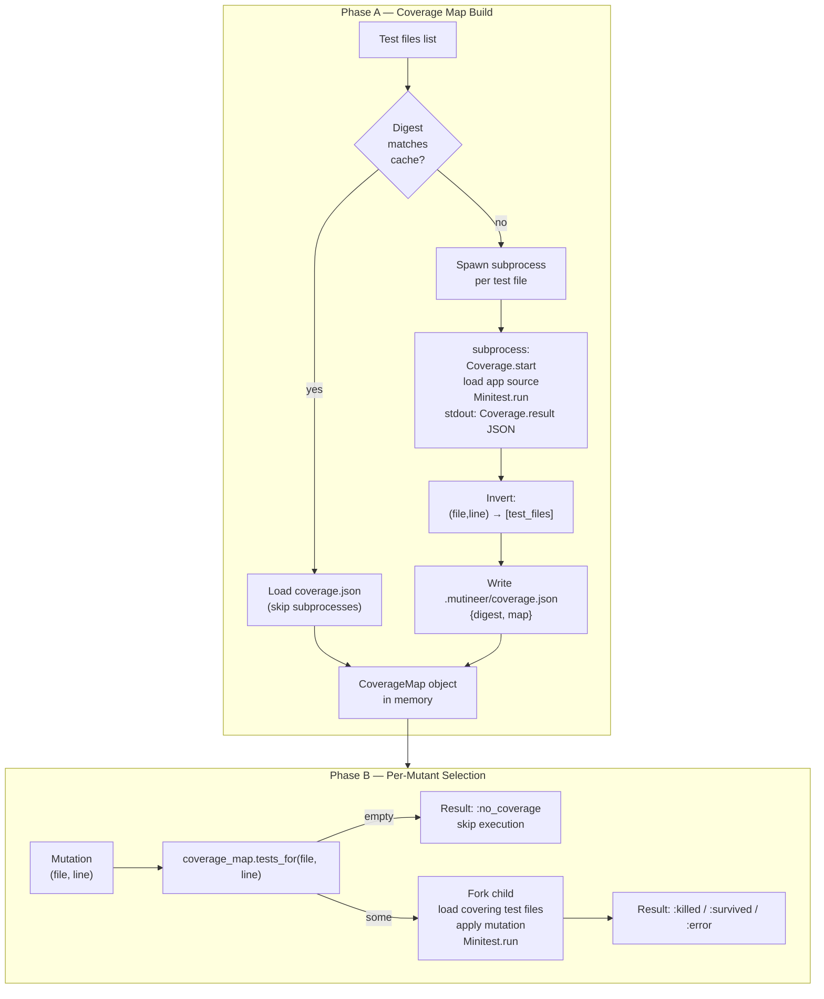

# M3 Coverage Map and Selection - Plan

**Depends on:** M2 (runner, isolation, fork worker, minitest_integration)
**Blocks:** M4 (full Tier-1 operators + reporting + CI)

---

## Goal Capsule

- **Objective:** Build and wire the coverage map so each mutant is run only against the test files that actually exercise its mutated line. Surface uncovered lines as `:no_coverage` rather than executing them.
- **Authority:** Spec §8 (coverage-based test selection), §9 (run loop Phase B), `docs/plans/_DECISIONS.md` (locked decisions).
- **Stop condition:** If implementing coverage capture reveals that `Coverage.start` semantics differ materially from the spec's assumption (e.g., line-level coverage unavailable in the target Ruby version), surface it rather than guessing.
- **Execution profile:** Standard — implement units in dependency order, run `rake test` after each unit lands.
- **Tail ownership:** M3 is complete when the acceptance gate passes and `rake test` is green. M4 begins after.

---

## Product Contract

### Summary

Naive mutation testing runs the full test suite per mutant — unusably slow at scale. Ruby's stdlib `Coverage` module lets us build a map from `(source_file, line)` → `[test_files]` by running each test file once and recording which source lines it exercises. Once that map exists, each mutant only needs to run the subset of tests that cover its mutated line. Lines no test touches are flagged `:no_coverage` and skipped entirely (useful signal, not counted in the score denominator).

### Problem Frame

M2 established end-to-end mutation execution against a single hardcoded test file. M3 replaces that hardcoding with a principled, content-keyed coverage map so:
1. Covered mutations run only their covering test files (faster, more targeted).
2. Uncovered mutations are flagged explicitly rather than falsely "survived."

### Requirements

**Coverage map — Phase A**

- R1. For each test file, run it in an isolated subprocess with `Coverage.start(lines: true)` active and the app source loaded under Coverage's tracking window.
- R2. Collect `Coverage.result` from each subprocess; record which `(source_file, line)` pairs had non-zero execution counts.
- R3. Invert the per-test data into a single map: `coverage_map[(file, line)] → [test_files...]`. A line covered by two test files appears in both entries.
- R4. Persist the map to `.mutineer/coverage.json` with a digest key derived from the content of all source and test files.
- R5. On subsequent runs, load the cached map when the digest matches; rebuild and overwrite when it does not.
- R6. If a per-test subprocess fails (test errors, load errors), log a warning and skip that test file's contribution — do not abort Phase A.

**Phase B — selection and no-coverage**

- R7. For each mutation on `(file, line)`, look up the covering test files from the map.
- R8. When the lookup returns an empty set, record a `:no_coverage` result for that mutation and skip execution.
- R9. When the lookup returns one or more test files, pass exactly those files to the isolation child to load and run.
- R10. `:no_coverage` mutants are reported separately and excluded from the mutation score denominator (`killed / (killed + survived)`).

**Test and acceptance gate**

- R11. `test/coverage_map_test.rb` covers the Phase A subprocess logic, map inversion, and cache load/save/invalidation.
- R12. An integration-level acceptance test verifies: a mutation on an uncovered fixture line yields `:no_coverage`; a covered mutation selects exactly the right test file(s); a changed test file causes cache rebuild.

### Scope Boundaries

**Per-test-file granularity only.** Per-test-method coverage (finer selection) is explicitly deferred; note it as future work, do not build it.

**Deferred to Follow-Up Work**
- Parallel subprocess dispatch for Phase A (Phase A runs serially per test file in v1).
- `--since <git-ref>` incremental mode — out of v1 per locked decisions.
- `.mutineer.yml` config integration — M5.

**Outside this product's identity**
- RSpec integration, Windows support, network/distributed execution — non-goals per spec §14.

### Locked Decisions Relevant to M3

From `docs/plans/_DECISIONS.md`:
- Ruby 3.4+ only; `require 'coverage'` and `require 'json'` directly from stdlib. No extra gems.
- Stack discipline: Prism + stdlib only. `coverage`, `json`, `digest`, `open3`, `Process.fork` available.
- Clean-room: no `mutant` gem code referenced.
- Platform: Linux + macOS (fork-based). `Process.fork` is available.

---

## Planning Contract

### Key Technical Decisions

**KTD1 — Fresh subprocess (not fork) for Phase A capture.**
Coverage.start must be called before app code is loaded to track line execution. If we fork from the parent (which already has app code `require`d), Coverage won't see those previously-loaded lines. Instead, spawn a fresh `ruby` subprocess for each test file. The subprocess starts Coverage, then loads the load paths, app source, and test file in order. Communication back to the parent is via stdout (JSON), with the parent using `Open3.capture2` to collect it.

**KTD2 — Inline script via stdin.**
The per-test subprocess script is a short Ruby heredoc passed to `ruby -` via stdin (no temp file, no script on disk). It sequences: `Coverage.start(lines: true)` → load path setup → load app source files → disable `Minitest.autorun` → load test file → `Minitest.run([])` → print `Coverage.result.to_json`. Disabling autorun before loading the test file (same pattern as Phase B's `minitest_integration.rb`) ensures the explicit `Minitest.run([])` call controls execution timing, so Coverage.result is captured after all test code has run.

**KTD3 — Content-based digest for cache invalidation.**
The cache key is `Digest::SHA256.hexdigest` over the concatenated contents of all source paths and test paths, sorted by path. Content-based (not mtime-based) ensures correctness across git checkouts, file copies, and editor saves-without-changes. A change to any file flips the digest and triggers a full rebuild. The digest is stored as the `"digest"` field in `.mutineer/coverage.json` alongside the map.

**KTD4 — JSON map key format: `"file:line"` strings, in memory and on disk.**
The map uses `"file:line"` string keys everywhere — in the in-memory `Hash` and in the JSON cache. Keeping one key format eliminates the round-trip conversion between array keys and string keys on every load and save. `#tests_for(file, line)` looks up `@map["#{file}:#{line}"]`. Paths are relative to the project root so the cache is portable across machines. On load, the JSON map is assigned directly to `@map` (values are already arrays of strings); no key transformation needed.

**KTD5 — No-coverage is a first-class result status.**
`Result` gets `:no_coverage` as a valid status alongside `:killed`, `:survived`, `:error`, `:timeout`. The reporter counts it, displays the list of no-coverage mutants (file:line, operator), and clearly excludes them from the score denominator. The score formula is `killed / (killed + survived)` only.

**KTD6 — CoverageMap is a plain Ruby class, not a singleton.**
`CoverageMap.new(source_paths:, test_paths:, cache_dir:, load_paths:, project_root:)` returns an object with `#build_or_load` (Phase A) and `#tests_for(file, line)` (Phase B lookup). The runner receives an instance. No global state. `project_root:` defaults to `Dir.pwd`; `load_paths:` defaults to `["lib"]`.

### High-Level Technical Design

Phase A builds the map; Phase B consumes it. The two phases are separated by cache persistence.



### Assumptions

- `rake test` is the project test runner (consistent with M0/M2 plans).
- The runner receives source paths, test paths, and load paths from the CLI/Config; CoverageMap receives them at construction.
- `project_root:` defaults to `Dir.pwd`; the runner or CLI may override it when running from outside the project root.
- `.mutineer/` directory is created if absent (a one-line `FileUtils.mkdir_p` in CoverageMap#save).
- Minitest autorun suppression via `module Minitest; def self.autorun; end; end` before loading test files works in Ruby 3.4+. (This is the same pattern used in Phase B's `minitest_integration.rb` from M2.)
- `Coverage.result` returns absolute paths. The coverage map must relativize them against `project_root` before storing, and must relativize `mutation.file` before looking up.

### Sequencing

U1 and U2 are both in `lib/mutineer/coverage_map.rb` and can be implemented together. U3 is a prerequisite for U4 (runner needs the `:no_coverage` status). U5 (reporter) depends on U3. U6 (tests) requires U1–U5 to exist.

---

## Implementation Units

### U1. CoverageMap — Phase A subprocess capture and map inversion

**Goal:** Implement the per-test-file subprocess runner that captures line coverage and inverts it into the `(file, line) → [test_files]` map.

**Requirements:** R1, R2, R3, R6

**Dependencies:** none (new file)

**Files:**
- `lib/mutineer/coverage_map.rb` (new)

**Approach:**
- `CoverageMap.new` accepts `source_paths:`, `test_paths:`, `cache_dir:`, `load_paths:` (default `["lib"]`), and `project_root:` (default `Dir.pwd`).
- `#run_phase_a` iterates `test_paths`. For each, it spawns a fresh subprocess via `Open3.capture2('ruby', '-', stdin_data: script, ...)` where `script` is an inline heredoc.
- The script sequence inside the subprocess: require `coverage` and `json`; call `Coverage.start(lines: true)`; add `load_paths` to `$LOAD_PATH`; load each `source_path` (using `load`, not `require`, so the file runs under Coverage tracking); suppress `Minitest.autorun`; load the test file; call `Minitest.run([])` explicitly; print `Coverage.result.to_json` to stdout.
- Parent reads stdout as JSON: `{ "/abs/path/to/source.rb" => [nil, 1, 0, 2, ...], ... }` (Coverage.result always returns absolute paths).
- **Path relativization:** before recording, strip the `project_root + "/"` prefix from each absolute path: `abs_path.delete_prefix("#{@project_root}/")`. If the path is outside `project_root` (no matching prefix), skip it — it is a stdlib or gem file, not a project source.
- For each relativized source file in the result, record lines with count > 0 as covered by this test file.
- Track which test files failed to contribute (subprocess exits non-zero or stdout is invalid JSON): collect into `@failed_test_files`. Log a warning to stderr per R6 and continue.
- After all subprocesses, build `@map = {}`. For each `(source_file, line, test_file)` triple, `(@map["#{source_file}:#{line}"] ||= []) << test_file`.
- If a subprocess exits non-zero or stdout is not valid JSON, log to stderr and skip (R6); add the test file path to `@failed_test_files`.
- `#tests_for(file, line)` relativizes `file` against `project_root` if absolute, then returns `@map["#{file}:#{line}"] || []`.

**Patterns to follow:** `lib/mutineer/isolation.rb` for the fork/subprocess pattern from M2; `lib/mutineer/minitest_integration.rb` for the autorun-suppression pattern.

**Test scenarios:**
- Happy path: subprocess for `test/fixtures/calculator_strong_test.rb` returns coverage data including lines from `test/fixtures/calculator.rb`; after inversion, `tests_for('test/fixtures/calculator.rb', 5)` returns `['test/fixtures/calculator_strong_test.rb']`.
- Multiple test files cover same line: both appear in the returned array.
- Subprocess exits non-zero (simulate by a test file that raises a load error): Phase A logs a warning and continues; other test files' coverage is still captured.
- Source file not exercised by any test: `tests_for` returns `[]` for any line in that file.

**Verification:** `tests_for` on a line known to be covered returns the expected test file(s); `tests_for` on an uncovered line returns `[]`.

---

### U2. CoverageMap — digest computation and cache persistence

**Goal:** Compute a content-based digest of all source and test files; load the cached map if the digest matches; rebuild and save otherwise.

**Requirements:** R4, R5

**Dependencies:** U1

**Files:**
- `lib/mutineer/coverage_map.rb` (extend)

**Approach:**
- `#compute_digest` reads all `source_paths + test_paths`, sorts by path, concatenates content, and returns `Digest::SHA256.hexdigest(combined)`. Require `digest` from stdlib.
- `#cache_path` returns `File.join(@cache_dir, 'coverage.json')`.
- `#build_or_load` is the public entry point: compute digest; if `.mutineer/coverage.json` exists, parse it; if `"digest"` matches, assign `@map` directly from `"map"` (string keys, no transformation needed) and check `"failed_test_files"` — if non-empty, log a warning that the cached map may be incomplete and name the affected test files; if `"digest"` does not match, call `#run_phase_a` then `#save`.
- `#save` creates the cache dir with `FileUtils.mkdir_p(@cache_dir)`, serializes to `{ "digest": digest, "failed_test_files": [...], "map": { "lib/foo.rb:10": [...] } }` JSON, and writes atomically (write to `.mutineer/coverage.json.tmp`, then `File.rename`).
- On load, `@map` is set directly from the `"map"` value — keys are already `"file:line"` strings, values are arrays of strings. No key parsing needed.

**Test scenarios:**
- Fresh run (no cache): `build_or_load` calls Phase A, writes cache; `.mutineer/coverage.json` exists after.
- Subsequent run (digest matches): `build_or_load` loads from cache; subprocess is NOT spawned (verify by asserting no subprocess invocation).
- Source file changes content: digest changes; `build_or_load` rebuilds and overwrites cache.
- Test file changes content: same — cache is invalidated and rebuilt.
- Cache file is corrupt JSON: rescue parse error, rebuild from scratch.

**Verification:** Cache file exists after first run; second run with identical files loads without subprocess calls; after modifying a fixture, the cache is rebuilt.

---

### U3. Result — `:no_coverage` status

**Goal:** Add `:no_coverage` as a first-class result status in `Result`.

**Requirements:** R8, R10

**Dependencies:** none

**Files:**
- `lib/mutineer/result.rb` (modify)

**Approach:**
- Add `Result.no_coverage` factory class method alongside existing `Result.killed`, `Result.survived`, `Result.error`, `Result.timeout` (the M2-established factory pattern; `Result` is `Struct.new(:status, :details)`).
- Add `#no_coverage?` predicate returning `result.status == :no_coverage`.
- No other behavioral change — `Result` is a value object; the runner sets the status, the reporter reads it.

**Test scenarios:**
- `Result.no_coverage` produces a result where `result.status == :no_coverage`.
- `result.no_coverage?` returns `true` only for results created via `Result.no_coverage`.
- `result.killed?`, `result.survived?` return `false` for a no-coverage result.

**Verification:** Existing result tests still pass; new `:no_coverage` status accepted without error.

---

### U4. Runner — Phase B coverage-based selection

**Goal:** Wire `CoverageMap` into the runner's mutation loop: look up covering tests per mutation, emit `:no_coverage` for empty lookups, pass covering tests to the isolation child.

**Requirements:** R7, R8, R9

**Dependencies:** U1, U2, U3

**Files:**
- `lib/mutineer/runner.rb` (modify)
- `lib/mutineer/isolation.rb` (modify — accept a list of test files instead of a hardcoded single file)

**Approach:**
- Runner receives a `CoverageMap` instance (injected, not constructed internally — keeps it testable).
- Runner calls `coverage_map.build_or_load` once before the mutation loop.
- In the loop, for each mutation: call `coverage_map.tests_for(mutation.file, mutation.line)`.
  - Empty → append `Result.no_coverage`, `next`. If `mutation.file` is not present as a key in any entry of the map (i.e., the file never appeared in any Coverage.result), log a distinct warning: "file not indexed in coverage map — check source_paths config." This distinguishes a config error from a genuinely uncovered line.
  - Non-empty → pass the array of test file paths to the isolation child.
- `isolation.rb` (the fork child wrapper from M2) currently loads a single hardcoded test file. Update it to accept `test_files:` (Array) and load each in sequence before calling `Minitest.run([])`. Autorun suppression already handled by `minitest_integration.rb`.
- The mutation loop structure and fork/waitpid logic in runner.rb are unchanged.

**Patterns to follow:** The existing fork-per-mutant loop from M2's runner.rb; isolation.rb's child-side load sequence.

**Test scenarios:**
- Mutation on covered line: isolation child receives exactly the covering test files (not all test files).
- Mutation on uncovered line: result is `:no_coverage` without forking a child.
- Mutation covered by two test files: both are passed to the child and both are loaded.
- `coverage_map.build_or_load` is called exactly once per runner invocation (not per mutation).

**Verification:** On the calculator fixtures, an arithmetic mutation on a covered line produces `:killed` (strong test) or `:survived` (weak test); a mutation on an uncovered line produces `:no_coverage`.

---

### U5. Reporter — surface no-coverage in output

**Goal:** Count `:no_coverage` mutants, display them separately in the report, and exclude them from the mutation score denominator.

**Requirements:** R10

**Dependencies:** U3

**Files:**
- `lib/mutineer/reporter.rb` (modify)

**Approach:**
- Partition results by status: `killed`, `survived`, `no_coverage`, `error`, `timeout`, `skipped` (invalid).
- Score formula: `killed.size.to_f / (killed.size + survived.size)` — only those two in the denominator. Display as a percentage; guard against divide-by-zero (0 killed + 0 survived → report "N/A" or 0%).
- Summary line format:
  ```
  Mutations: N  Killed: K  Survived: S  No coverage: NC  Skipped: I
  Mutation score: X%  (NC no-coverage mutants excluded from score)
  ```
- List no-coverage mutants after the survivor list (or in their own section), showing `file:line` and operator name. Keep it brief — no diff needed for no-coverage (there's nothing to diff against a failing test).

**Test scenarios:**
- All results killed: score = 100%; no-coverage section absent or shows 0.
- Mix of killed/survived/no-coverage: score = killed/(killed+survived); no-coverage count shown separately.
- All results no-coverage: score line shows "N/A" (0 + 0 denominator); no-coverage list shows all.
- Zero total mutations: graceful output ("No mutations generated").

**Verification:** Reporter output includes the no-coverage count and the score denominator excludes no-coverage mutants.

---

### U6. Tests — coverage_map_test.rb and acceptance gate

**Goal:** Unit tests for `CoverageMap` and a fixture-based acceptance gate covering the no-coverage and selection scenarios.

**Requirements:** R11, R12

**Dependencies:** U1, U2, U3, U4, U5

**Files:**
- `test/coverage_map_test.rb` (new)

**Approach:**
- Unit tests for `CoverageMap`:
  - `#compute_digest` produces identical results for identical file sets; differs when a file changes.
  - `#tests_for` returns correct test files after a real (not mocked) Phase A run against fixtures.
  - Cache load/save round-trip: build, inspect cache file, reload, assert `tests_for` gives same results.
  - Cache invalidation on file change.
- Acceptance gate (integration-level, using real fixture files):
  - Build coverage map over `test/fixtures/calculator.rb` and both calculator test files.
  - Assert a covered line (e.g., the `+` operator line) maps to at least one test file.
  - Assert that if a line exists in `calculator.rb` that no test exercises (add a dead branch to the fixture, or use a line only reachable via a path no test takes), `tests_for` returns `[]`.
  - Run the runner on the calculator fixture with coverage map active; assert a mutation on the uncovered line produces a result with status `:no_coverage`.
  - Assert a mutation on a covered line produces `:killed` (strong test) or `:survived` (weak test), not `:no_coverage`.

**Patterns to follow:** Existing fixture test structure from M2's `runner_test.rb`.

**Test scenarios:**
- Covered line → `tests_for` returns non-empty array.
- Uncovered line → `tests_for` returns `[]`.
- End-to-end: mutation on uncovered line → `:no_coverage` result.
- End-to-end: mutation on covered line → `:killed` or `:survived` (not `:no_coverage`).
- Cache rebuild: modify fixture file content, call `build_or_load` again, assert subprocesses ran.
- Cache hit: call `build_or_load` twice on identical files; assert Phase A subprocess only ran once.

**Verification:** `ruby -Ilib -Itest test/coverage_map_test.rb` exits 0 with all tests passing.

---

## Verification Contract

| Gate | Command | Pass condition |
|---|---|---|
| Unit tests | `ruby -Ilib -Itest test/coverage_map_test.rb` | All tests green |
| Full suite | `rake test` | All tests green (M2 tests still pass) |
| Acceptance: no-coverage | Run runner on calculator fixture with an uncovered line mutation | Result status is `:no_coverage`, no child process forked |
| Acceptance: selection | Run runner with strong test covering a line | Result is `:killed`; only the covering test file was loaded in the child |
| Cache hit | Run `build_or_load` twice, unchanged files | Second call skips subprocess; `.mutineer/coverage.json` unchanged |
| Cache miss | Modify a fixture file, run `build_or_load` | Cache rebuilt; new digest in `.mutineer/coverage.json` |

---

## Definition of Done

- `rake test` passes with all M2 tests still green and all new M3 tests green.
- `test/coverage_map_test.rb` exists and covers Phase A, cache load/save, invalidation, and `tests_for` lookup.
- A mutation on a line no test exercises produces `:no_coverage` in the result set.
- A mutation on a covered line selects only the covering test files for the child (verified via test assertion, not just by inspection).
- `.mutineer/coverage.json` is written after the first run and reused on subsequent identical runs.
- Reporter output shows the no-coverage count and excludes those mutants from the score denominator.
- No-coverage and covered-line acceptance scenarios both pass against the calculator fixture.
- Dead-end or abandoned implementation code (experimental subprocess approaches, unused helper methods) is removed from the final diff.

**Future work note (not in scope):** Per-test-method coverage for tighter selection — would require Coverage with `oneshot_lines: true` or custom tracing, and Minitest test-method isolation. Note in a comment in `coverage_map.rb` at the `tests_for` method: `# ponytail: per-file granularity; upgrade to per-method when throughput warrants (requires Minitest method isolation + finer Coverage tracking)`.

---

## Validation

**Validator:** `intent-engineering:ie-validate-plan` (v0.5.0)
**Run ID:** `20260628-013942-159123be`
**Lenses:** predictability (inherit), simplicity (inherit), convention (sonnet)

### Dimensional Ratings

| Lens | Dimension | Score | Gap |
|---|---|---|---|
| Predictability | Return contract consistency | 6/10 | `tests_for` returned `[]` for both legitimate no-coverage and path-mismatch; caller could not distinguish |
| Predictability | Failure transparency | 6/10 | Subprocess failures cached as incomplete map; subsequent runs silently served stale results |
| Predictability | Representation fidelity | 6/10 | Coverage.result returns absolute paths; KTD4 specified relative paths; no relativization step described |
| Simplicity | Essential vs accidental complexity | 7/10 | Dual key format (string in JSON, array in memory) added needless round-trip conversion |
| Convention | Repo consistency | 6/10 | U3 test scenario used `Result.new(mutation, :no_coverage)` — inverts Struct fields vs M2 factory pattern |
| Convention | Framework idiom | 7/10 | KTD6 interface omitted `load_paths:` kwarg that U1 silently added |
| Predictability | Name/behavior fidelity | 8/10 | — (no finding) |
| Simplicity | Abstraction earns its keep | 9/10 | — |
| Simplicity | Dependency restraint | 10/10 | — |
| Convention | Configuration restraint | 9/10 | — |

### Findings Applied

All findings from the validation pass were folded back into the plan before finalizing:

1. **P1 — Path relativization (predictability):** Added `project_root:` kwarg to KTD6 and CoverageMap.new. Specified the `delete_prefix` step in U1. Added assumption that Coverage.result paths are absolute and must be relativized. Added `#tests_for` relativization note.

2. **P1 — Incomplete cache from subprocess failures (predictability):** Added `failed_test_files` field to the JSON cache shape. `#build_or_load` now warns on cache load when `failed_test_files` is non-empty.

3. **P1 — `tests_for` ambiguity (predictability):** Added a distinct warning in U4 when `mutation.file` is not present in any coverage map entry (distinguishes config error from genuine no-coverage).

4. **P2 — Dual key format (simplicity):** KTD4 updated to use `"file:line"` string keys in memory and on disk. Eliminated round-trip conversion on load and save. `#tests_for` uses `@map["#{file}:#{line}"]`.

5. **P2 — Result.new struct field inversion (convention):** U3 approach and test scenarios updated to use `Result.no_coverage` factory method consistent with the M2 pattern. Added `#no_coverage?` predicate.

6. **P3 — KTD6 interface mismatch (convention):** KTD6 now shows the full interface including `load_paths:` and `project_root:` with their defaults.

### Unresolved Gaps

None. All P1/P2/P3 findings resolved.
