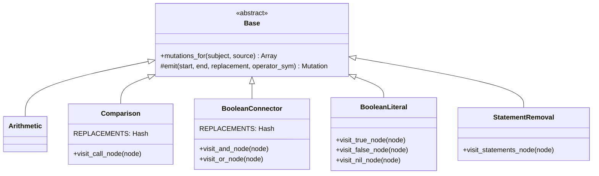
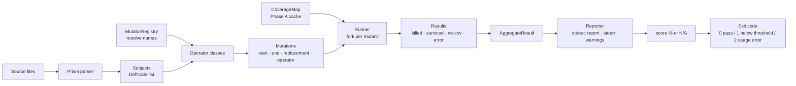

# M4 — Full Tier-1 Operators, Statement Removal, Reporting, and CI Gate

**One-line goal:** Complete the default operator set (four Tier-1 + statement-removal), wire the reporter (score + survivor diffs), add `--threshold` CI exit codes and `--operators` toggle, and prove the exact expected survivor set against the full fixture suite.

**Depends on:** M3 (coverage map, fork isolation, runner skeleton, `Result`, per-operator base class, `Mutation`, `Subject`)
**Blocks:** M5 (parallel workers, `.mutineer.yml`, remaining Tier-2 ops, JSON output, surgical method redefinition)

---

## Locked Decisions (M4-relevant)

From `docs/plans/_DECISIONS.md` — do not re-litigate:

| # | Decision | Locked choice | M4 implication |
|---|---|---|---|
| 1 | Ruby minimum | **3.4+ only** | `require "prism"` directly; no `prism` gem |
| 2 | Default operator set (v1) | **Tier-1 × 4 + statement-removal** | statement-removal is ON by default in M4, not M5 |
| 4 | Gem name | **`mutineer`** | `module Mutineer` throughout |
| Stack | Textual mutation only | No `unparser` | Byte-range substitution; all operators rewrite exact token/node ranges |
| Stack | One mutation per mutant | Never combine | Each operator emits independent `Mutation` objects |
| Stack | Validity rule | Prism re-parse | Every mutated source string re-parsed; errors → discard, count as `skipped_invalid` |
| Clean-room | No `mutant` gem | Spec + public literature | Call this out in every operator implementation comment |

---

## Scope

### In scope

- `comparison.rb` — `<`↔`<=`, `>`↔`>=`, `==`↔`!=` on `CallNode` `message_loc`
- `boolean_connector.rb` — `&&`↔`||` (and `and`↔`or`) on `AndNode`/`OrNode` `operator_loc`
- `boolean_literal.rb` — `true`↔`false`, `nil`→`true` on `TrueNode`/`FalseNode`/`NilNode` whole `location`
- `statement_removal.rb` — replace each non-final method statement with `"nil"`; skip if body has ≤ 1 statement
- `mutator_registry.rb` — name→class hash, `DEFAULT_NAMES` = all five, `resolve(names)` raises `ArgumentError` on unknown
- `reporter.rb` — `AggregateResult` + `Reporter`; summary stats (total/killed/survived/no-cov/skipped/errored); mutation score %; per-survivor unified-style diff grouped by file
- `--operators LIST` CLI flag — comma-separated operator names; default = all five
- `--threshold FLOAT` CLI flag — exit 1 when score < threshold; default 0/off
- `runner.rb` update — use registry, collect results from all operators, pass to reporter, apply exit code
- `test/fixtures/pricing.rb` and `test/fixtures/pricing_test.rb` — boundary-miss fixture per spec §12
- Unit tests per new operator (`test/mutators/comparison_test.rb`, etc.)
- `test/integration_test.rb` — exact survivor assertions for all three fixture scenarios

### Out of scope (M5)

- `--format json`
- Parallel worker pool (`--jobs`)
- `.mutineer.yml` config file
- Surgical method redefinition (strategy 7b)
- Remaining Tier-2 operators: return-nil, literal mutation, condition negation
- `--since` mode (out of v1 entirely per locked decisions)

---

## Product Contract

### Summary

M3 established the coverage-map pipeline with a single hardcoded operator (arithmetic). M4 completes the default operator set that ships in v1 — all four Tier-1 families plus statement-removal (pulled forward from M5 per Decision #2) — and wires the result reporter, mutation score, and CI exit-code gate. The integration test then runs Mutineer against the full defined fixture set and asserts the exact expected survivor set, proving the pipeline correct end-to-end.

### Requirements

- R1: All five operators run by default when no `--operators` flag is given
- R2: `--operators arithmetic,comparison` restricts to exactly those two operators; other operators generate no mutations
- R3: `MutatorRegistry.resolve` with an unknown name raises `ArgumentError` naming the unknown operator
- R4: Reporter summary shows: total, killed, survived, no-coverage, skipped (invalid), errored, mutation score %
- R5: Mutation score = `killed / (killed + survived) × 100`. The denominator is **killed + survived only** — no-coverage, skipped (invalid), and errored are ALL excluded. When the denominator is 0 (no testable mutants), the score is `nil` (rendered "N/A"), never `0.0`. Each excluded count is shown separately.
- R6: Each surviving mutant in the report shows: fully-qualified subject, file:line, operator name, and a diff (original source line prefixed `-`, mutated line prefixed `+`)
- R7: Survivors are grouped by source file in the report
- R8: `--threshold FLOAT` (default 0 = off): exits 1 if score < threshold; exits 0 if score ≥ threshold or threshold = 0. When score is `nil` (no testable mutants), the threshold check is **skipped** and the run exits 0 with a "no covered mutations; threshold check skipped" warning to stderr.
- R12: CLI error surface — an unknown `--operators` value, or an out-of-range `--threshold` (outside 0.0–100.0), prints a plain-language message to **stderr** and exits **2** (distinct from threshold-failure exit 1). The raw `ArgumentError` backtrace never reaches the user.
- R13: When zero mutations are generated, the reporter prints a distinct message ("No mutations generated — verify target files contain in-scope operators and are reached by the suite") rather than an ambiguous `0.0%` line. Exit 0.
- R14: Stream discipline — the report (summary, score, survivors, no-coverage list, verdict) goes to **stdout**; warnings and errors go to **stderr**, so `mutineer … > report.txt` captures only the report.
- R9: Integration test — pricing scenario: exactly 1 survivor (`Pricing#total`, operator `comparison`, `>=`→`>`)
- R10: Integration test — calculator + strong test: 0 survivors, score = 100.0%
- R11: Integration test — calculator + weak test: exactly 2 survivors (`Calculator#add` `+`→`-`, `Calculator#subtract` `-`→`+`)

### Scope Boundaries

**Deferred to Follow-Up Work (M5)**
- `--format json` for machine-readable CI output
- Parallel worker pool (`--jobs N`)
- Surgical method redefinition (reduces fork load, deferred per spec §7b)

**Outside this product's identity**
- RSpec, Windows, equivalent-mutant detection, distributed execution, `--since` mode

---

## Planning Contract

### Key Technical Decisions

**KTD-1: statement_removal replaces non-final statements with `"nil"`; final expression always skipped**

Replace each non-final statement's range (`stmt.location.start_offset..stmt.location.end_offset`) with the string `"nil"`. The final statement (index = `body.body.length - 1`) is always skipped — returning nil from the last expression is the M5 return-nil operator's job. If `body.body.length < 2`, no mutations are generated (only one statement = it is both first and final). The Prism validity re-parse is still applied per the standing rule, but these replacements always produce valid Ruby.

*Rationale: Non-final statements are typically side effects (assignments, calls). Replacing them with nil tests whether the test suite detects the missing effect. Replacing the final expression with nil tests return-value behavior — a distinct concern owned by a distinct M5 operator. Clean separation avoids double-counting and keeps the M5 operator independently meaningful.*

**KTD-2: boolean_connector replacement derived from `operator_loc.slice`**

`AndNode#operator_loc.slice` and `OrNode#operator_loc.slice` return the actual source token (`&&`, `||`, `and`, `or`). The replacement is derived by toggling the actual token text via a frozen `REPLACEMENTS` hash (`{"&&" => "||", "||" => "&&", "and" => "or", "or" => "and"}`). This handles both keyword and symbolic forms correctly without hardcoding node type to specific strings.

*Naming note (convention): every operator's swap map is named `REPLACEMENTS` (a frozen Hash), matching the precedent set by `arithmetic.rb` in M1. Do not introduce per-operator synonyms (`SWAPS`, `TOGGLE`) — one concept, one word, across all five operator files. `operator_loc.slice` returns byte-indexed source; fixtures are ASCII-only so multi-byte offset skew is not a concern in v1.*

*Rationale: A method that replaces `&&` with `or` would change operator precedence, potentially creating semantically different (and surprising) mutants. Matching form to form keeps mutations conservative and the diff readable.*

**KTD-3: reporter diff extracts the containing source line from the raw source string**

For each surviving mutant, the reporter resolves the containing line via newline counting on the stdlib `String` API rather than hand-rolled `rindex`/`index` scanning (which has an awkward line-1 edge case). Directional:
- `line_index = source[0...mutation.start_offset].count("\n")` (0-based)
- `original_line = source.lines[line_index].chomp`
- `mutated_full = Mutineer::Mutation.apply(source, mutation)` then `mutated_line = mutated_full.lines[line_index].chomp`

The full original line (stripped) is shown with `-` prefix; the mutated line with `+` prefix. Source texts are passed to `Reporter` as a hash of `file_path => source_string`, populated by the runner from already-loaded files.

*Rationale: `String#lines` + a newline count is one stdlib expression and correct at line 1, where back-scanning for `\n` is not. Reusing `Mutation.apply` (already built in M1) for the mutated line avoids a second substitution code path. Showing the full line gives context without unparser or AST regeneration.*

**KTD-4: mutation score denominator = killed + survived ONLY; empty denominator → `nil`, not `0.0`**

`score = killed.to_f / (killed + survived) × 100`. The denominator is exactly `killed + survived` — **no-coverage, skipped (invalid), and errored are all excluded**, not just no-coverage. (No-coverage are real signals but cannot be killed; skipped/errored never ran.) Each excluded bucket is reported separately with its own count.

When `killed + survived == 0` (no testable mutants), `mutation_score` returns **`nil`**, rendered as "N/A". This is deliberate: returning `0.0` would conflate "testable mutants existed but none were killed" (a bad suite) with "nothing was testable" (a setup/coverage problem) — two states needing opposite corrective actions. The `--threshold` gate special-cases `nil` by skipping the comparison (see KTD-8).

*Predictability note: KTD-4's earlier draft said "excludes no-coverage" but the formula also drops errored and skipped. The wording is now aligned to the formula so an implementer writes the same denominator the formula requires.*

**KTD-5: MutatorRegistry uses `DEFAULT_NAMES = ALL.keys.freeze`; unknown name raises**

```
ALL = {
  "arithmetic"        => Mutators::Arithmetic,
  "comparison"        => Mutators::Comparison,
  "boolean_connector" => Mutators::BooleanConnector,
  "boolean_literal"   => Mutators::BooleanLiteral,
  "statement_removal" => Mutators::StatementRemoval,
}.freeze
DEFAULT_NAMES = ALL.keys.freeze
```

`resolve(names = DEFAULT_NAMES)` maps names to classes; any unknown name raises `ArgumentError` immediately. The runner calls `MutatorRegistry.resolve(config.operators || MutatorRegistry::DEFAULT_NAMES)`. The `--operators` CLI flag splits on comma, strips whitespace.

*Why `DEFAULT_NAMES` is a separate constant even though it equals `ALL.keys` in M4 (simplicity tension):* M5 adds three more operators (return-nil, literal, condition-negation) that are in `ALL` but gated OFF by default per the locked decision. At that point `DEFAULT_NAMES ⊊ ALL.keys`. Keeping the seam now is the M5 extension point, not speculative generality — it is named in the very next milestone. The `MutatorRegistry` class itself is mandated by spec §12 (file `mutator_registry.rb`) and §4 ("keep a registry mapping operator name → class"); it is not a discretionary abstraction. If M5 review finds the class still earns nothing, collapsing it to a module-level constant + one-line `fetch` guard is a trivial follow-up — but the spec asks for it by name, so M4 ships it.

**KTD-6: comparison generates exactly one mutation per site; boundary pairs are strict**

Each comparison token maps to exactly one replacement via the operator's frozen `REPLACEMENTS` hash: `<`→`<=`, `<=`→`<`, `>`→`>=`, `>=`→`>`, `==`→`!=`, `!=`→`==`. No combinatoric expansion. Guard: `node.receiver` must be non-nil (reject unary calls accidentally named `==`).

**KTD-7: Result carries both subject and mutation; AggregateResult holds the flat list; `total` is the sum of all buckets**

`Result` (updated from M3) carries `status`, `subject`, and `mutation`. `AggregateResult` holds an array of all `Result` objects and provides computed counts and `surviving_mutants`. `total` is defined as **`killed + survived + no_coverage + skipped + errored`** — the count of all generated, classified mutations (it is NOT the score denominator; that is `killed + survived` only). This flat structure is sufficient for M4's serial runner; a worker-pool design in M5 may need a concurrent accumulator.

*Status vocabulary (predictability): the invalid-mutation bucket is named consistently `skipped_invalid` everywhere — the `Result` status symbol is `:skipped_invalid` and the `AggregateResult` accessor is `skipped_invalid_count`. statement_removal's final-expression skip never produces a `Result` at all (no mutation is generated), so it does not enter any count — confirmed so a future maintainer does not add a double-counting "skipped final" tally.*

**KTD-8: `--threshold` gate, exit codes, and the `nil`-score case**

Exit codes follow POSIX convention so CI can distinguish failure classes:
- **0** — score ≥ threshold, OR threshold = 0 (off), OR score is `nil` (no testable mutants; threshold check skipped with a stderr warning).
- **1** — score < threshold (genuine mutation-coverage failure).
- **2** — usage/argument error: unknown `--operators` value, or `--threshold` outside 0.0–100.0. Plain-language message to stderr; no backtrace.

The runner catches `ArgumentError` from `MutatorRegistry.resolve` (and validates the threshold range) at the CLI boundary, prints the message to stderr, and exits 2. When `--threshold` is active, the reporter prints a final verdict line to stdout — `PASSED: 72.3% >= threshold 60.0%` or `FAILED: 34.1% < threshold 60.0%` — so the CI log tail shows the verdict without the reader re-deriving it from the score and the configured threshold.

*Note: `--threshold 0` meaning "off" is spec-locked (§10: "default off / 0"). The `threshold == 0` short-circuit is intentional, not redundant guard code — it documents the off-state at the call site.*

### High-Level Technical Design

#### Operator class hierarchy



(All operator swap maps are named `REPLACEMENTS`, matching `arithmetic.rb`. StatementRemoval overrides `visit_statements_node`, not `visit_def_node` — see U4.)

#### M4 data flow



#### Reporter output structure

```
Mutineer — Mutation Results
=========================

Summary
-------
Total:        N       Killed:        N
Survived:     N       No coverage:   N
Skipped:      N       Errored:       N

Mutation score: XX.X%  (killed / (killed + survived); N no-coverage, M skipped, E errored excluded)

Surviving Mutants
-----------------

test/fixtures/pricing.rb
  Pricing#total (pricing.rb:3)
  Operator: comparison  (>= → >)
  - if price >= 100
  + if price > 100

PASSED: 72.3% >= threshold 60.0%        ← verdict line, only when --threshold active
```

Edge-case renderings:
- **No testable mutants** (`killed + survived == 0`): score line reads `Mutation score: N/A  (no covered mutants)`; threshold check skipped; stderr warning emitted.
- **Zero mutations generated**: replaces the whole report body with `No mutations generated — verify target files contain in-scope operators and are reached by the suite.` (stderr), exit 0.
- All non-report diagnostics (warnings, the N/A explanation, usage errors) go to **stderr**; the summary/survivor/verdict block goes to **stdout**.

### Prism Node + Rewrite Range Reference

| Operator | Prism node | Trigger condition | Range | Replacement |
|---|---|---|---|---|
| comparison | `CallNode` | `name` ∈ `{:<, :<=, :>, :>=, :==, :!=}` AND `receiver` non-nil | `message_loc.start_offset..message_loc.end_offset` | paired swap from `REPLACEMENTS` |
| boolean_connector | `AndNode` | always | `operator_loc.start_offset..operator_loc.end_offset` | `&&`↔`\|\|`, `and`↔`or` (derived from slice) |
| boolean_connector | `OrNode` | always | `operator_loc.start_offset..operator_loc.end_offset` | same derivation |
| boolean_literal | `TrueNode` | always | `location.start_offset..location.end_offset` | `"false"` |
| boolean_literal | `FalseNode` | always | `location.start_offset..location.end_offset` | `"true"` |
| boolean_literal | `NilNode` | always | `location.start_offset..location.end_offset` | `"true"` |
| statement_removal | `StatementsNode` body entries | body.length ≥ 2; index < last | `stmt.location.start_offset..stmt.location.end_offset` | `"nil"` |

### Sequencing

U1–U4 (operators) are independent of each other and can proceed in any order. U5 (registry) requires U1–U4 to exist (classes must be defined). U6 (reporter) requires Result and the runner's output shape from M3. U7 (CLI wiring) requires U5 and U6. U8 (fixtures + integration test) requires U1–U7 complete.

### Fixture mutation analysis (determines exact integration test assertions)

**pricing.rb** (`Pricing#total`): 2 mutations total with the 5-operator default set.
- `>=`→`>` (comparison): **SURVIVES** — `pricing_test.rb` tests `total(150)=135.0` and `total(50)=50` but never `total(100)`; the mutant (`>` instead of `>=`) returns 100 for `total(100)` vs 90.0 from the original, but no test calls `total(100)`.
- `*`→`/` (arithmetic, `price * 0.9`): **KILLED** — `total(150)` with `/` returns `150/0.9≈166.7` vs expected `135.0`.
- No boolean, statement_removal, or additional comparison mutations in this simple fixture.

**calculator.rb** (6 single-expression methods): 6 arithmetic mutations; no comparison/boolean/statement_removal mutations.
- Strong test: all 6 killed (each test uses values that distinguish the operator pair).
- Weak test: `add(5,0)=5` and `subtract(5,0)=5` do not distinguish `+`/`-` or `-`/`+` when one operand is 0 → 2 survivors; `multiply(2,3)=6`, `divide(6,2)=3`, `modulo(7,3)=1`, `power(2,3)=8` all distinguish → 4 killed.

---

## Output Structure (M4 new files)

```
mutineer/
  lib/mutineer/
    mutators/
      comparison.rb          ← U1 (new)
      boolean_connector.rb   ← U2 (new)
      boolean_literal.rb     ← U3 (new)
      statement_removal.rb   ← U4 (new)
    mutator_registry.rb      ← U5 (new)
    reporter.rb              ← U6 (new)
    result.rb                ← U6 (update: AggregateResult; ensure Result carries subject)
    cli.rb                   ← U7 (update: --operators, --threshold)
    config.rb                ← U7 (update: operators, threshold attributes)
    runner.rb                ← U7 (update: use registry, build AggregateResult, call reporter)
  test/
    fixtures/
      pricing.rb             ← U8 (new)
      pricing_test.rb        ← U8 (new)
    mutators/
      comparison_test.rb     ← U1 (new)
      boolean_connector_test.rb ← U2 (new)
      boolean_literal_test.rb   ← U3 (new)
      statement_removal_test.rb ← U4 (new)
    integration_test.rb      ← U8 (new or update)
```

---

## Implementation Units

### U1. Comparison operator (`comparison.rb`)

**Goal:** Implement the boundary/comparison mutation family — the highest-value Tier-1 operator per spec §4.

**Requirements:** R1, R2

**Dependencies:** M3 (`mutators/base.rb`, `mutation.rb`, `arithmetic.rb` as pattern)

**Files:**
- `lib/mutineer/mutators/comparison.rb` (new)
- `test/mutators/comparison_test.rb` (new)

**Approach:**
- `Mutineer::Mutators::Comparison < Mutineer::Mutators::Base`
- `REPLACEMENTS` constant (frozen Hash; same name as `arithmetic.rb`): `{:< => "<=", :<= => "<", :> => ">=", :>= => ">", :== => "!=", :!= => "=="}`
- Override `visit_call_node(node)`:
  - Early return if `REPLACEMENTS[node.name].nil?` or `node.message_loc.nil?` or `node.receiver.nil?`
  - Emit one `Mutation` with `start_offset: node.message_loc.start_offset`, `end_offset: node.message_loc.end_offset`, `replacement: REPLACEMENTS[node.name]`, `operator: :comparison`
  - Call `super` to recurse into nested comparisons (e.g., `a >= b && c <= d` → two mutations)
- `mutations_for(subject, source)`: initialize `@mutations = []`, call `super` (Base handles the `def_node.body&.accept(self)` dispatch)

**Key Prism APIs:**
- `CallNode#name` → Symbol (`:>=`, `:<`, etc.)
- `CallNode#message_loc` → `Prism::Location` with `#start_offset`, `#end_offset`
- `CallNode#receiver` → non-nil for binary operator calls

**Patterns to follow:** `lib/mutineer/mutators/arithmetic.rb` — same `CallNode` + `message_loc` pattern, same REPLACEMENTS-constant structure.

**Test scenarios:**
- `price >= 100` → 1 mutation: `>= → >` at `message_loc`
- `price <= 100` → 1 mutation: `<= → <`
- `a < b` → 1 mutation: `< → <=`
- `a > b` → 1 mutation: `> → >=`
- `x == y` → 1 mutation: `== → !=`
- `x != y` → 1 mutation: `!= → ==`
- `a + b` (arithmetic, not comparison) → 0 mutations from this operator
- `a >= b && c <= d` → 2 mutations (one per comparison node; `super` recurses)
- `source[m.start_offset...m.end_offset]` equals the original operator text for every emitted mutation (offset accuracy)
- Emitted mutation passes `Mutation.valid?(source, mutation)` check

**Verification:** `ruby -Ilib -Itest test/mutators/comparison_test.rb` passes. Dry-run on `test/fixtures/pricing.rb` emits exactly 1 comparison mutation (`>=`→`>`) at the correct byte offset.

---

### U2. Boolean connector operator (`boolean_connector.rb`)

**Goal:** Implement `&&`↔`||` and `and`↔`or` mutations.

**Requirements:** R1, R2

**Dependencies:** M3 (`mutators/base.rb`, `mutation.rb`)

**Files:**
- `lib/mutineer/mutators/boolean_connector.rb` (new)
- `test/mutators/boolean_connector_test.rb` (new)

**Approach:**
- `Mutineer::Mutators::BooleanConnector < Mutineer::Mutators::Base`
- Override `visit_and_node(node)` and `visit_or_node(node)`
- Replacement is derived from `node.operator_loc.slice` (the actual source token text):
  - `"&&"` → `"||"`, `"||"` → `"&&"`, `"and"` → `"or"`, `"or"` → `"and"`
  - Implement as a frozen Hash named `REPLACEMENTS` (consistent with every other operator — not `TOGGLE`): `REPLACEMENTS = {"&&" => "||", "||" => "&&", "and" => "or", "or" => "and"}.freeze`
- Emit one `Mutation` with `start_offset: node.operator_loc.start_offset`, `end_offset: node.operator_loc.end_offset`, `replacement: REPLACEMENTS[node.operator_loc.slice]`, `operator: :boolean_connector`
- Call `super` in each visitor method to recurse into nested connectors

**Key Prism APIs:**
- `AndNode#operator_loc` → `Prism::Location`; `#slice` returns `"&&"` or `"and"`
- `OrNode#operator_loc` → `Prism::Location`; `#slice` returns `"||"` or `"or"`

**Test scenarios:**
- `a && b` → 1 mutation: replacement is `"||"` at `operator_loc`
- `a || b` → 1 mutation: replacement is `"&&"`
- `a and b` → 1 mutation: replacement is `"or"`
- `a or b` → 1 mutation: replacement is `"and"`
- `a && b && c` → 2 mutations (one per `&&`; super recurses)
- `a && b || c` → 2 mutations (one per connector)
- `a + b` → 0 mutations from this operator
- Replacement preserves token form: `&&` stays symbolic, `and` stays keyword (no cross-form mixing)
- `source[m.start_offset...m.end_offset]` equals the original connector token for every mutation

**Verification:** `ruby -Ilib -Itest test/mutators/boolean_connector_test.rb` passes.

---

### U3. Boolean literal operator (`boolean_literal.rb`)

**Goal:** Implement `true`↔`false` and `nil`→`true` mutations.

**Requirements:** R1, R2

**Dependencies:** M3 (`mutators/base.rb`, `mutation.rb`)

**Files:**
- `lib/mutineer/mutators/boolean_literal.rb` (new)
- `test/mutators/boolean_literal_test.rb` (new)

**Naming note (predictability):** the operator name `boolean_literal` and file `boolean_literal.rb` are fixed by spec §4 ("Boolean / nil literal") and §12 — `nil` handling is in-scope by design, not name drift, even though `nil` is not strictly a boolean. The class doc comment must state this explicitly (`# Mutates true/false AND nil literals — "boolean_literal" is the spec's name for the family (§4).`) so a reader running `--operators boolean_literal` is not surprised that `nil` is touched.

**Approach:**
- `Mutineer::Mutators::BooleanLiteral < Mutineer::Mutators::Base`
- Override `visit_true_node(node)`, `visit_false_node(node)`, `visit_nil_node(node)`
- Replacements:
  - `TrueNode` → `"false"`
  - `FalseNode` → `"true"`
  - `NilNode` → `"true"` (nil→false is lower signal; nil→true catches more return-value gaps)
- Range: `node.location.start_offset..node.location.end_offset` (the whole node; these nodes have no sub-locations)
- Emit one `Mutation` with `operator: :boolean_literal`
- Call `super` in each override to recurse into nested structures

**Key Prism APIs:**
- `TrueNode#location`, `FalseNode#location`, `NilNode#location` → `Prism::Location` with `#start_offset`, `#end_offset`
- Note: these nodes expose the whole-node `location` (not a sub-token `message_loc` or `operator_loc`)

**Test scenarios:**
- `return true` → 1 mutation: `true → false` spanning the literal
- `return false` → 1 mutation: `false → true`
- `return nil` → 1 mutation: `nil → true`
- `valid = true; enabled = false` (two statements) → 2 mutations
- `foo(nil)` → 1 mutation: `nil → true` in the argument position
- Method with no boolean/nil literals → 0 mutations
- `source[m.start_offset...m.end_offset]` equals the original literal text
- Emitted mutations are syntactically valid after application (Prism re-parse check)

**Verification:** `ruby -Ilib -Itest test/mutators/boolean_literal_test.rb` passes.

---

### U4. Statement removal operator (`statement_removal.rb`)

**Goal:** Implement statement-deletion mutation — replace each non-final method statement with `"nil"`.

**Requirements:** R1, R2

**Dependencies:** M3 (`mutators/base.rb`, `mutation.rb`). U1–U3 are independent; U4 can proceed in parallel.

**Files:**
- `lib/mutineer/mutators/statement_removal.rb` (new)
- `test/mutators/statement_removal_test.rb` (new)

**Approach:**
- `Mutineer::Mutators::StatementRemoval < Mutineer::Mutators::Base`
- Override `visit_statements_node(node)` — `Base#mutations_for` calls `def_node.body&.accept(self)`, and a multi-statement method body is a `StatementsNode`, so the visitor is invoked on that body node (not the `DefNode`):
  - `stmts = node.body` (Array of statement AST nodes)
  - If `stmts.length < 2`, return immediately (no non-final statements)
  - For each statement at index `0..(stmts.length - 2)` (all except last):
    - Emit one `Mutation` with `start_offset: stmt.location.start_offset`, `end_offset: stmt.location.end_offset`, `replacement: "nil"`, `operator: :statement_removal`
  - Do NOT call `super`. **This is a deliberate departure from the repo's "always call super to recurse" visitor idiom — it must carry an explicit comment** (`# ponytail: no super — recursing into a nested StatementsNode would re-emit removals already covered at the top level and double-count. Each subject's body is visited once.`). Without the comment the next contributor will "fix" the missing super and silently break the operator.

  *Implementation note:* The base class calls `subject.def_node.body&.accept(self)`. When the body is a `StatementsNode`, the visitor receives a call to `visit_statements_node`. When the body is a single expression (e.g., endless def), it is that expression node directly — in that case `visit_statements_node` is never called and no mutations are generated (correct: single-expression bodies have no non-final statements).

**Key Prism APIs:**
- `DefNode#body` → `StatementsNode` (multi-statement body) or the expression node (endless def) or `nil` (empty method)
- `StatementsNode#body` → `Array` of statement AST nodes
- `stmt.location.start_offset`, `stmt.location.end_offset` — span the statement's source text

**Test scenarios:**
- 1-statement method: `def f; x; end` → 0 mutations
- 2-statement method: `def f; side_effect; x; end` → 1 mutation (replace `side_effect` with `"nil"`)
- 3-statement method → 2 mutations (first two; last skipped)
- Empty method: `def f; end` → 0 mutations (body is nil)
- Non-final statement is an assignment: `x = compute` → replaced with `nil`; source is parseable Ruby
- Non-final statement is a method call: `logger.info(x)` → replaced with `nil`; source is parseable
- Prism re-parse of each generated mutant source returns no errors
- Last statement is never a mutation target regardless of its type
- Endless def (`def f(x) = x + 1`) → 0 mutations (body is not a StatementsNode)

**Verification:** `ruby -Ilib -Itest test/mutators/statement_removal_test.rb` passes. Dry-run on a 3-statement fixture method shows 2 statement-removal mutations (indices 0 and 1; index 2 absent).

---

### U5. MutatorRegistry and `--operators` toggle

**Goal:** Central name→class registry; default = all five; unknown names fail loudly.

**Requirements:** R1, R2, R3

**Dependencies:** U1, U2, U3, U4 (all operator classes must be defined before the registry references them)

**Files:**
- `lib/mutineer/mutator_registry.rb` (new)
- `lib/mutineer/cli.rb` (update: parse `--operators LIST`)
- `lib/mutineer/config.rb` (update: `operators` attribute, default = `nil` meaning "all")

**Approach:**

`MutatorRegistry` directional design:
```
module Mutineer
  class MutatorRegistry
    ALL = {
      "arithmetic"        => Mutators::Arithmetic,
      "comparison"        => Mutators::Comparison,
      "boolean_connector" => Mutators::BooleanConnector,
      "boolean_literal"   => Mutators::BooleanLiteral,
      "statement_removal" => Mutators::StatementRemoval,
    }.freeze
    DEFAULT_NAMES = ALL.keys.freeze

    def self.resolve(names = DEFAULT_NAMES)
      names.map { |n| ALL.fetch(n) { raise ArgumentError, "Unknown operator: #{n.inspect}" } }
    end
  end
end
```

CLI update:
- Add `--operators LIST` to the optparse block in the `run` subcommand
- Parse: `config.operators = LIST.split(",").map(&:strip)` — keep as array of strings
- No flag: `config.operators` remains `nil`

Config update:
- Add `operators` attribute (default `nil`)
- Add `threshold` attribute (default `0.0`) — used by U7/U6

Runner update (preview for U7):
- Replace any hardcoded operator list with `MutatorRegistry.resolve(config.operators || MutatorRegistry::DEFAULT_NAMES)`

**Test scenarios:**
- `MutatorRegistry.resolve` with no args returns array of all 5 classes in defined order
- `resolve(["arithmetic", "comparison"])` returns exactly `[Arithmetic, Comparison]`
- `resolve(["arithmetic"])` returns `[Arithmetic]` only
- `resolve(["unknown"])` raises `ArgumentError` with the unknown name in the message
- `resolve([])` returns `[]` (empty list, no mutations; edge case, not an error)
- `--operators arithmetic` on a file with boolean connectors: boolean_connector generates 0 mutations
- Default (no flag): all 5 operators run; all 5 classes are instantiated per subject

**Verification:** Unit test for `MutatorRegistry` passes. CLI with `--operators comparison` on `pricing.rb` produces only the `>=`→`>` mutation in dry-run.

---

### U6. Reporter and result aggregation

**Goal:** Aggregate all per-mutant results into a structured object; render human-readable output with score and survivor diffs grouped by file.

**Requirements:** R4, R5, R6, R7, R8

**Dependencies:** M3 (`result.rb` with `:no_coverage` status, runner output shape)

**Files:**
- `lib/mutineer/result.rb` (update: add `AggregateResult`; verify `Result` carries `subject` and `mutation`)
- `lib/mutineer/reporter.rb` (new)

**Approach:**

**`Result` verification/update:** Confirm (or add) that `Result` from M3 carries:
- `status`: Symbol — `:killed | :survived | :no_coverage | :skipped_invalid | :errored | :timeout`
- `subject`: `Mutineer::Subject`
- `mutation`: `Mutineer::Mutation`

If `Result = Data.define(:status, :subject, :mutation)` (or struct equivalent), add `subject` if absent.

**`AggregateResult` (new):**
- `initialize(results)` — accepts flat `Array<Result>`
- Counts: `killed_count`, `survived_count`, `no_coverage_count`, `skipped_invalid_count`, `errored_count` (names match the `Result` status symbols exactly — see KTD-7)
- `total`: `killed + survived + no_coverage + skipped_invalid + errored` (count of all generated mutations; NOT the denominator — see KTD-7)
- `covered_count`: `killed_count + survived_count` (the score denominator; for display)
- `mutation_score`: `(killed_count.to_f / covered_count * 100).round(1)` when `covered_count > 0`; **returns `nil` when `covered_count == 0`** (per KTD-4 — `nil` distinguishes "no testable mutants" from "0% killed")
- `surviving_mutants`: `results.select { |r| r.status == :survived }`

**`Reporter` (new):**
- `initialize(aggregate, source_map)` — `source_map` is `Hash<String, String>` (file_path → raw source string); populated by runner from already-read files
- `report(out: $stdout, err: $stderr)` — writes the human summary + survivor list + (when threshold active) the verdict line to `out`; writes warnings (N/A explanation, zero-mutation message) to `err`. Two streams per R14.
- `exit_code(threshold:)` — returns:
  - `0` if `threshold == 0` (off), OR `aggregate.mutation_score.nil?` (no testable mutants — skip the gate, warning already emitted), OR `mutation_score >= threshold`
  - `1` if `mutation_score < threshold`
  - (Usage-error exit `2` is the CLI boundary's job — see U7, not here.)
- When `aggregate.total == 0`: `report` writes only the zero-mutation message to `err` (R13) and the summary block is suppressed.

**Diff extraction (directional — per KTD-3, via `String#lines`):**
For a mutation with `start_offset..end_offset` in `source`:
1. `line_index = source[0...mutation.start_offset].count("\n")` (0-based; correct at line 1, no back-scan)
2. `original_line = source.lines[line_index].chomp`
3. `mutated_line = Mutineer::Mutation.apply(source, mutation).lines[line_index].chomp` (reuses M1's `apply`)
4. Display: `"  - #{original_line.strip}"` / `"  + #{mutated_line.strip}"`

**Survivor grouping:**
- `surviving_mutants.group_by { |r| r.mutation.file }` — one section per source file
- Within each file, sort by line number (derived from `start_offset` via the newline count above)

**Test scenarios:**
- `AggregateResult` with 0 results: `mutation_score` is `nil`, all counts zero, `total == 0`
- All killed (6 results): score = 100.0, `surviving_mutants` empty
- 1 killed + 1 survived + 2 no-coverage: score = 50.0 (not 25.0); no-coverage counted separately, NOT in denominator
- 3 killed + 1 survived + 2 no-coverage + 1 errored + 1 skipped_invalid: score = 75.0 (`3/(3+1)`); errored and skipped_invalid also excluded from denominator; `total == 8`
- All no-coverage (0 killed + 0 survived): `mutation_score` is `nil`
- `exit_code(threshold: 0)`: always 0
- `exit_code(threshold: 80.0)` with score 75.0: returns 1
- `exit_code(threshold: 80.0)` with score 80.0: returns 0 (inclusive)
- `exit_code(threshold: 100.0)` with any survivor: returns 1
- `exit_code(threshold: 80.0)` when score is `nil`: returns 0 (gate skipped)
- Reporter groups two survivors from `pricing.rb` and one from `calculator.rb` under two file sections
- Diff for pricing `>=`→`>`: shows `- if price >= 100` / `+ if price > 100`
- Diff at line 1 of a file (no preceding newline): original/mutated lines resolve correctly (the `String#lines` edge case)
- Threshold-active run: a `PASSED:`/`FAILED:` verdict line appears as the final stdout line; verdict text matches the exit code
- `total == 0`: zero-mutation message goes to the `err` stream, not `out`; `out` is empty
- `report(out: StringIO.new, err: StringIO.new)` captures both streams without touching the real stdout/stderr (test capture)

**Verification:** Unit tests pass. Running Mutineer on `pricing.rb` + `pricing_test.rb` prints the survivor with correct operator name, file:line, and diff to stdout; warnings (if any) to stderr.

---

### U7. CLI wiring (`--operators`, `--threshold`)

**Goal:** Wire the registry and reporter into the run command; expose both new flags.

**Requirements:** R2, R8, R12, R14

**Dependencies:** U5 (registry), U6 (reporter), M3 (`cli.rb`, `runner.rb`, `config.rb`)

**Files:**
- `lib/mutineer/cli.rb` (update)
- `lib/mutineer/config.rb` (update — `operators` and `threshold` may already be added in U5; confirm here)
- `lib/mutineer/runner.rb` (update: use registry, build aggregate, call reporter, apply exit code)

**Approach:**

CLI optparse additions (in the `run` subcommand block):
- `--operators LIST` → `config.operators = LIST.split(",").map(&:strip)`
- `--threshold FLOAT` → `config.threshold = FLOAT.to_f`

**CLI error boundary (R12 — the run command wraps execution):**
- Wrap the operator resolution + run in a `rescue ArgumentError => e` at the CLI level. On rescue: print `"mutineer: #{e.message}"` (e.g. `mutineer: Unknown operator: "arithmtic"`) to **stderr**, and `exit 2`. The raw backtrace never reaches the user.
- Validate `--threshold` is within `0.0..100.0` at parse time; out of range → `warn "mutineer: --threshold must be between 0 and 100"`; `exit 2`.
- Exit codes are centralized: `0` pass, `1` below threshold (from `reporter.exit_code`), `2` usage error (from this boundary). See KTD-8.

Runner update:
1. `operator_classes = MutatorRegistry.resolve(config.operators || MutatorRegistry::DEFAULT_NAMES)` (raises `ArgumentError` on unknown — caught at the CLI boundary above)
2. For each subject, run all `operator_classes`, applying `mutations_for(subject, source)` and collecting all returned `Mutation` objects
3. After the mutation loop, build `AggregateResult.new(results)`
4. `reporter = Reporter.new(aggregate, source_map)` where `source_map = sources.to_h { |f| [f, File.read(f)] }` (thread the already-read source through — see Risks)
5. `reporter.report` (report to stdout, warnings to stderr)
6. `exit(reporter.exit_code(threshold: config.threshold))`

The `--dry-run` path (M1) also uses the registry. With `--operators`, dry-run lists mutations from only the active operators, grouped per operator with a per-operator count plus a total, e.g. `comparison: 1, arithmetic: 1 — 2 mutations (dry run, not executed)`.

**Test scenarios:**
- `--operators arithmetic` on `pricing.rb`: only 1 arithmetic mutation listed; no comparison mutation
- `--operators comparison,boolean_connector`: exactly those two operators active
- No `--operators` flag: all 5 operators run
- `--operators arithmtic` (typo): prints `mutineer: Unknown operator: "arithmtic"` to stderr, exits 2 (NOT 1)
- `--threshold 150`: prints range error to stderr, exits 2
- `--threshold 100` on `pricing.rb` + `pricing_test.rb`: runner exits 1 (1 survivor, score = 50.0%)
- `--threshold 100` on `calculator.rb` + `calculator_strong_test.rb`: exits 0 (score = 100.0%)
- `--threshold 0` (default, or explicit): always exits 0
- `--threshold 66` on calculator + weak test (score = 66.7%): exits 0 (66.7 >= 66)
- `--threshold 67` on calculator + weak test (score = 66.7%): exits 1
- Stdout redirect: `mutineer ... > out.txt` captures the report; the unknown-operator error still appears on the terminal (stderr), not in `out.txt`

**Verification:** CLI invocation tests above pass. `mutineer run --operators comparison test/fixtures/pricing.rb --test test/fixtures/pricing_test.rb` emits exactly 1 survivor. A typo'd operator name exits 2 with a stderr message and no backtrace.

---

### U8. Fixtures and integration test (acceptance gate)

**Goal:** Define the `pricing.rb`/`pricing_test.rb` fixture pair; write exact-assertion integration tests for all three fixture scenarios.

**Requirements:** R9, R10, R11

**Dependencies:** U1–U7 (all operators, registry, reporter, CLI complete)

**Files:**
- `test/fixtures/pricing.rb` (new)
- `test/fixtures/pricing_test.rb` (new)
- `test/fixtures/calculator.rb` (verify matches M1 spec — 6 methods; no changes expected)
- `test/fixtures/calculator_strong_test.rb` (verify or update — must kill all 6 arithmetic mutants)
- `test/fixtures/calculator_weak_test.rb` (verify or update — must leave exactly 2 survivors)
- `test/integration_test.rb` (new or extend)

**Fixture specifications:**

`test/fixtures/pricing.rb`:
```
class Pricing
  def total(price)
    if price >= 100
      price * 0.9
    else
      price
    end
  end
end
```

`test/fixtures/pricing_test.rb`:
```
Tests total(150) == 135.0   (150 * 0.9 = 135.0)
Tests total(50)  == 50      (50 < 100, no discount)
Does NOT test total(100)    (this is the deliberate gap — creates the >=→> survivor)
```

`test/fixtures/calculator.rb` (confirm matches M1 U6): 6 methods (`add`, `subtract`, `multiply`, `divide`, `modulo`, `power`), each with exactly one arithmetic operator and a single-expression body. No changes expected.

`test/fixtures/calculator_strong_test.rb` — tests that kill all 6 arithmetic mutations:
- `add(2, 3) == 5` → kills `+`→`-` (`2-3=-1 ≠ 5`)
- `subtract(5, 3) == 2` → kills `-`→`+` (`5+3=8 ≠ 2`)
- `multiply(3, 4) == 12` → kills `*`→`/` (`3/4=0 ≠ 12`)
- `divide(12, 3) == 4` → kills `/`→`*` (`12*3=36 ≠ 4`)
- `modulo(7, 3) == 1` → kills `%`→`*` (`7*3=21 ≠ 1`)
- `power(2, 3) == 8` → kills `**`→`*` (`2*3=6 ≠ 8`)

`test/fixtures/calculator_weak_test.rb` — tests designed to leave exactly 2 survivors:
- `add(5, 0) == 5` → does NOT kill `+`→`-` (`5-0=5 = expected`)
- `subtract(5, 0) == 5` → does NOT kill `-`→`+` (`5+0=5 = expected`)
- `multiply(2, 3) == 6` → kills `*`→`/` (`2/3=0 ≠ 6`)
- `divide(6, 2) == 3` → kills `/`→`*` (`6*2=12 ≠ 3`)
- `modulo(7, 3) == 1` → kills `%`→`*` (`7*3=21 ≠ 1`)
- `power(2, 3) == 8` → kills `**`→`*` (`2*3=6 ≠ 8`)

**Integration test helper:** `run_mutineer(sources:, tests:, operators: nil)` — instantiates `Mutineer::Config`, runs Phase A coverage map, invokes runner, returns `AggregateResult`. Does NOT go through the CLI subprocess (uses the library API directly to avoid process overhead and to keep assertions on structured objects rather than string output).

**Integration test exact assertions (`test/integration_test.rb`):**

*Scenario A — pricing boundary survivor (R9):*
```
result = run_mutineer(sources: ["test/fixtures/pricing.rb"],
                    tests: ["test/fixtures/pricing_test.rb"])

assert_equal 1, result.survived_count,
  "Expected exactly 1 survivor from pricing.rb + pricing_test.rb"

s = result.surviving_mutants.first
assert_equal "Pricing",    s.subject.namespace.last
assert_equal "total",      s.subject.name.to_s
assert_equal :comparison,  s.mutation.operator
assert_equal ">=",         source_token(s)   # source[s.mutation.start_offset...s.mutation.end_offset]
assert_equal ">",          s.mutation.replacement
```

*Scenario B — calculator + strong, perfect score (R10):*
```
result = run_mutineer(sources: ["test/fixtures/calculator.rb"],
                    tests: ["test/fixtures/calculator_strong_test.rb"])

assert_equal 0,     result.survived_count,  "Expected 0 survivors with strong test"
assert_equal 100.0, result.mutation_score,  "Expected 100% mutation score"
assert_equal 6,     result.killed_count,    "Expected 6 killed mutations"
```

*Scenario C — calculator + weak, exact two survivors (R11):*
```
result = run_mutineer(sources: ["test/fixtures/calculator.rb"],
                    tests: ["test/fixtures/calculator_weak_test.rb"])

assert_equal 2, result.survived_count, "Expected exactly 2 survivors with weak test"

add_s = result.surviving_mutants.find { |r| r.subject.name.to_s == "add" }
sub_s = result.surviving_mutants.find { |r| r.subject.name.to_s == "subtract" }

refute_nil add_s, "Expected Calculator#add + → - to survive"
assert_equal :arithmetic, add_s.mutation.operator
assert_equal "+",         source_token(add_s)
assert_equal "-",         add_s.mutation.replacement

refute_nil sub_s, "Expected Calculator#subtract - → + to survive"
assert_equal :arithmetic, sub_s.mutation.operator
assert_equal "-",         source_token(sub_s)
assert_equal "+",         sub_s.mutation.replacement

assert_equal 4, result.killed_count,
  "Expected multiply, divide, modulo, power to be killed"

refute result.surviving_mutants.any? { |r| r.subject.name.to_s == "multiply" },
  "multiply * → / should be killed, not survived"
refute result.surviving_mutants.any? { |r| r.subject.name.to_s == "divide" },
  "divide / → * should be killed, not survived"
```

The assertions are framed as directional guidance; the implementer writes actual `Minitest::Test` methods using these exact checks. `source_token(result)` is a helper that extracts the original token from the source file via the mutation's `start_offset`/`end_offset`.

**Test scenarios:**
- All three integration scenarios pass (A, B, C)
- Each assert includes a descriptive failure message so failures identify the broken mutation by name
- `run_mutineer` helper does not rely on subprocess/CLI; uses the library API directly
- Integration test is isolated from other tests: does not share state, creates its own `.mutineer/` cache dir per test (or uses a temp dir and cleans up)

**Verification:** `ruby -Ilib -Itest test/integration_test.rb` passes. `rake test` (full suite) passes.

---

## Verification Contract

### Per-operator unit gates

| Operator | Command | Pass condition |
|---|---|---|
| comparison | `ruby -Ilib -Itest test/mutators/comparison_test.rb` | All green |
| boolean_connector | `ruby -Ilib -Itest test/mutators/boolean_connector_test.rb` | All green |
| boolean_literal | `ruby -Ilib -Itest test/mutators/boolean_literal_test.rb` | All green |
| statement_removal | `ruby -Ilib -Itest test/mutators/statement_removal_test.rb` | All green |

### Registry and CLI gates

| Gate | Check |
|---|---|
| Registry | `resolve` returns all 5 / subset / raises on unknown |
| `--operators` | Restricts mutation generation to named operators only |
| `--threshold 100` on pricing | Exit code 1 (survivor exists) |
| `--threshold 100` on calculator + strong | Exit code 0 (score = 100%) |
| Unknown `--operators` value | Exit code 2; plain message on stderr; no backtrace |
| `--threshold 150` (out of range) | Exit code 2; range message on stderr |
| All-no-coverage run | Score renders `N/A`; threshold gate skipped; exit 0 |
| Zero mutations generated | Distinct "no mutations" message on stderr; exit 0 |
| Stream discipline | Report on stdout, warnings/errors on stderr (`> out.txt` captures report only) |

### Integration acceptance gate (the big one)

| Scenario | Source | Test file | Expected survivors | Expected score |
|---|---|---|---|---|
| A — boundary miss | `pricing.rb` | `pricing_test.rb` | 1: `Pricing#total` `>=`→`>` (comparison) | 50.0% |
| B — strong kills all | `calculator.rb` | `calculator_strong_test.rb` | 0 | 100.0% |
| C — weak leaves two | `calculator.rb` | `calculator_weak_test.rb` | 2: `#add` `+`→`-`, `#subtract` `-`→`+` | 66.7% |

`ruby -Ilib -Itest test/integration_test.rb` must pass all three scenarios with these exact outcomes. A failure in scenario A means the comparison operator or coverage-map selection is broken. A failure in scenario B means a kill is being reported as survived. A failure in scenario C means either arithmetic is producing wrong mutations or the weak test fixtures need adjustment.

### Full suite gate

`rake test` passes (all M0–M3 tests still green; all new M4 tests green).

---

## Definition of Done

- [ ] All four new operator unit tests pass: comparison, boolean_connector, boolean_literal, statement_removal
- [ ] `MutatorRegistry.resolve` works: all five by default, subset on demand, `ArgumentError` on unknown
- [ ] `--operators` flag restricts operator set; absence means all five
- [ ] Unknown `--operators` value exits 2 with a plain stderr message and no backtrace; out-of-range `--threshold` exits 2
- [ ] Reporter output matches the format in the HTD section; survivor diffs show the correct original and mutated lines; report on stdout, warnings on stderr
- [ ] `--threshold` exit code: exits 1 when score < threshold; exits 0 when score ≥ threshold or threshold = 0
- [ ] `mutation_score` returns `nil` (renders "N/A") when no testable mutants exist; threshold gate skipped in that case (exit 0); `total` defined as the sum of all five buckets
- [ ] Operator swap maps are all named `REPLACEMENTS`; no `SWAPS`/`TOGGLE` synonyms; statement_removal carries the explicit no-`super` comment
- [ ] Integration test scenario A passes: exactly 1 survivor from pricing.rb (`Pricing#total` `>=`→`>`)
- [ ] Integration test scenario B passes: 0 survivors from calculator + strong test (score 100.0%)
- [ ] Integration test scenario C passes: exactly 2 survivors from calculator + weak test (`#add` `+`→`-`, `#subtract` `-`→`+`)
- [ ] `rake test` green (all milestones M0–M4)
- [ ] `ruby -Ilib -e 'require "mutineer"'` loads cleanly
- [ ] All M3 tests still pass (no regressions)

---

## Risks and Dependencies

| Risk | Likelihood | Mitigation |
|---|---|---|
| `StatementsNode` vs direct expression node for endless defs | Low | Guard: only visit `StatementsNode` in statement_removal; endless defs have a non-StatementsNode body and generate 0 mutations correctly |
| `AndNode`/`OrNode#operator_loc` API absent in some 3.4.x Prism versions | Low | Verify at M4 start: `ruby -e 'require "prism"; pp Prism::AndNode.instance_methods(false)'`; `operator_loc` present in Prism 1.x (bundled with Ruby 3.4) |
| `Result` from M3 missing `subject` field | Low-Medium | Verify M3's `result.rb`; add `subject` field if absent before building `AggregateResult` |
| calculator_weak_test.rb uses operands that distinguish `%`/`**` but not `+`/`-` correctly | Low | Fixture is designed precisely per the analysis in Planning Contract; verify by hand before wiring integration test |
| Source map required by Reporter not threaded through runner | Medium | Explicitly thread `source_map = {file => File.read(file)}` through runner to Reporter; add to U7 wiring |

---

## Validation

Validated with **`/ie-validate-plan`** (intent-engineering plan-mode lens fan-out). Document classified as `plan`. Lens team: predictability + simplicity (always-on), convention (sibling plans M1–M3 + arithmetic.rb establish repo idiom), experience (CLI is the user-facing surface). No `.intense/` config or CLAUDE.md present → plugin defaults. Architecture lens not run (code/audit only).

### Dimensional ratings (worst first)

| Lens | Dimension | Score | Gap (pre-fold) | Resolution |
|---|---|---|---|---|
| Experience | interaction_state_coverage | 4/10 | Unknown-operator error, zero-mutation state, all-no-coverage threshold edge unspecified | Folded: R12/R13 + KTD-8 (exit 2, distinct zero-mutation message, `nil`-score gate skip) |
| Experience | user_flow_completeness | 5/10 | No threshold verdict line; dry-run+operators output undefined | Folded: verdict line in reporter output; U7 dry-run per-operator grouping |
| Experience | information_architecture | 6/10 | stdout/stderr routing unspecified | Folded: R14 + reporter `report(out:, err:)` |
| Predictability | name_behavior_fidelity | 6/10 | boolean_literal also mutates nil; `total` formula undefined | Resolved: spec-locked name kept, mandatory class-doc note (U3); `total` formula pinned (KTD-7) |
| Predictability | return_contract_consistency | 6/10 | score 0.0 conflates "no testable mutants" with "0% killed" | Folded: `mutation_score` returns `nil`, not `0.0` (KTD-4) |
| Predictability | failure_transparency | 6/10 | KTD-4 denominator wording excluded more than it said | Folded: KTD-4 reworded — denominator is killed+survived only; no-coverage/skipped/errored all excluded |
| Simplicity | abstraction_earns_its_keep | 6/10 | MutatorRegistry / AggregateResult / DEFAULT_NAMES ceremony | Tension noted, not removed — registry is spec §4+§12 mandated and task-required; DEFAULT_NAMES is the M5 non-default-operator seam (named in next milestone). Documented in KTD-5. |
| Convention | repo_consistency | 7/10 | SWAPS/TOGGLE vs REPLACEMENTS naming drift | Folded: all swap maps renamed `REPLACEMENTS` (KTD-2, KTD-6, U1, U2, class diagram); statement_removal no-`super` rationale comment required (U4) |

All other dimensions scored ≥ 7 (representation_fidelity 8, framework_idiom 8, configuration_restraint 9, dependency_restraint 9, accessibility 7). No findings raised on the integration-test assertions — both always-on lenses confirmed they are exact (`assert_equal` on exact survivor count, subject, operator, source token, replacement), not fuzzy, and the predictability lens flagged the Scenario A pin as correctly load-bearing across the M5 boundary.

### Tensions recorded (decided, not dictated)

1. **Simplicity vs spec/convention authority — MutatorRegistry.** Simplicity lens rates the registry "pattern theater" for a static 5-entry frozen hash. Resolved in favor of the spec: §12 names the file `mutator_registry.rb` and §4 says "keep a registry mapping operator name → class," and the task requires it explicitly. Authority order (spec > generic ideal) governs. `DEFAULT_NAMES` is not speculative — M5 adds operators that are in `ALL` but off by default, making `DEFAULT_NAMES ⊊ ALL.keys`. Both documented in KTD-5 with the collapse path if M5 review disagrees.
2. **DWIM vs least-astonishment — `--threshold 0` as "off".** The `threshold == 0` short-circuit is spec-locked (§10: "default off / 0"). Kept and documented as intentional at the call site (KTD-8), not removed.

### Gaps deferred (advisory, non-blocking)

- ANSI colour in reporter output: not in M4 scope; if added later, pair colour with a text verb (noted as observation, no plan change).
- `--threshold` accepting a bare flag (no value) to mean "off" via an optional type instead of the `0.0` sentinel: advisory; spec fixes `0` as the off value, so not adopted.

### Verdict

**Ready to implement.** All design-blocking gaps (score contract, exit-code taxonomy, error surface, stream discipline, naming uniformity) folded into requirements, KTDs, and unit specs. The two surviving tensions are spec-authority decisions, not unresolved questions. Integration assertions are exact. No blocking gaps remain.

Artifacts: `wip/intent-engineering/20260628-014903-abcd/{predictability,simplicity,convention,experience}.json`.
