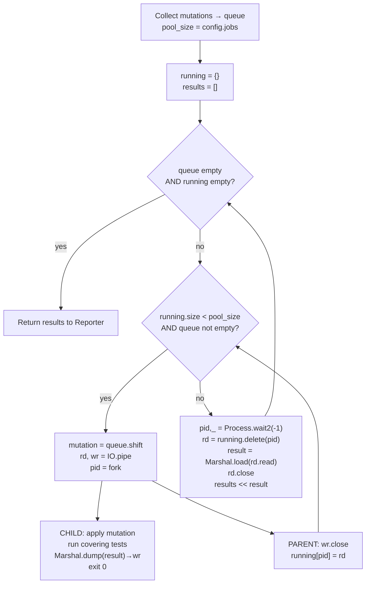

# M5 Polish - Plan

**One-line goal:** Ship parallel execution, `.mutineer.yml` config, the remaining three Tier-2 operators, surgical method redefinition (7b), and JSON report output — completing Mutineer v1.

**Depends on:** M4 (full Tier-1 operators, runner, reporter, coverage map, isolation 7a)
**Blocks:** nothing (ships v1)

---

## Goal Capsule

- **Objective:** Layer performance (parallel worker pool), ergonomics (config file), completeness (three flag-gated Tier-2 operators), precision (surgical 7b redefinition), and tooling integration (JSON output) onto the M4 baseline. Each sub-area is independently verifiable before the next.
- **Authority:** Spec §4 (Tier-2), §7b, §9, §10, §11 + locked decisions in `docs/plans/_DECISIONS.md`.
- **Stop condition:** All five Verification Contract gates pass. Do not implement `--since`, RSpec integration, Windows support, equivalent-mutant detection, or DSL mutation.
- **Execution profile:** Standard — implement units in dependency order; each unit has its own test file. The milestone can land across multiple commits; gate each sub-area before moving to the next.

---

## Product Contract

### Summary

M5 closes out v1. It does not change the mutation logic or coverage model established in M4; it parallelises the run loop, makes the tool configurable without repeated flags, adds three lower-signal operators gated behind flags, provides a more precise mutation application strategy, and emits machine-readable output for CI integration.

### Locked Decisions Relevant to M5

| Decision | Locked choice | M5 implication |
|---|---|---|
| Ruby minimum | `>= 3.4` only | `Etc.nprocessors` available in stdlib; `require "etc"` is sufficient |
| Default operators (v1) | Tier 1 + statement-removal ON | M5 Tier-2 ops (return_nil, literal, condition_negation) are OFF by default; toggled via `--operators` or `.mutineer.yml` |
| Config format | `.mutineer.yml` (YAML, stdlib `yaml`) | No Ruby DSL, no third-party schema library |
| Gem name | `mutineer` | `module Mutineer` |
| `--since` | Out of v1 | Do not plan or reference |
| Stack | Prism + stdlib only | `IO.pipe`, `Marshal`, `Process.fork`, `Process.wait2`, `yaml`, `json`, `etc` — all stdlib; no new gems |
| Clean-room | Do not read/reference/copy `mutant` source | Enforce throughout |
| Textual mutation | Byte-range substitution only; no AST regeneration | Applies to all three new operators and to 7b snippet construction |
| Validity rule | Re-parse every mutated source with Prism; discard if errors | Mandatory for all new operators and for 7b snippet before `class_eval` |
| One mutation per mutant | Never combine | All new operators emit one mutation at a time |

### Requirements

**Parallel worker pool**

- R1. `WorkerPool` forks up to `--jobs N` children simultaneously (default: `Etc.nprocessors`).
- R2. Each child communicates its `Result` to the parent via an `IO.pipe` + `Marshal.dump`/`Marshal.load`.
- R3. The parent reaps finished children with `Process.wait2(-1)` (blocking wait for any child) and opens a slot before forking the next mutation.
- R4. `--jobs N` must not change kill/survive verdicts compared with the serial run.
- R5. `runner.rb` wires the pool; `worker_pool.rb` is the pool abstraction.

**Config file**

- R6. `.mutineer.yml` is searched from CWD upward through parent directories. Boundary: `$HOME` is checked if reached, then the search stops; if CWD is above `$HOME` (e.g. `/tmp`), the walk continues to the filesystem root. First file found wins.
- R7. Supported keys: `operators` (list of strings), `jobs` (integer), `threshold` (float), `only` (list of FQ name patterns), `require` (list of paths). No schema validation beyond YAML parse, but an unknown key (or an unrecognized operator name in `operators`) emits a one-line `stderr` warning naming the key and the known set, then is ignored — the run continues. (Warn, don't abort: catches typos like `operatros:` without breaking CI.)
- R7a. A malformed `.mutineer.yml` (YAML/`Psych` syntax error) prints `mutineer: .mutineer.yml parse error: <message>` to stderr and exits 1 **before** any mutation run begins. It never silently falls back to defaults — a config the user wrote but that did not load is a surprise.
- R8. Precedence: CLI flag explicitly provided → config file value → hardcoded default. A CLI flag present on the command line always wins for that key; the config file never overrides a live flag. "Explicitly provided" means the user supplied the flag *and its value* on the command line, not that a flag fell back to its own default.
- R9. Config loading lives in `config.rb`; precedence merge happens in `cli.rb` after option parsing.

**Tier-2 operators (all OFF by default, all togglable via `--operators` / `operators:` in config)**

- R10. `return_nil`: visits `ReturnNode` and, unless its value is already a `NilNode`, replaces the value expression with `nil` (textual: replace the value byte-range with `nil`). Also visits each `DefNode` body and, if the final statement is not already a `ReturnNode` or `NilNode`, emits a mutation replacing the final expression range with `nil`. (The "skip if already nil" guard prevents no-op `nil`→`nil` mutations.)
- R11. `literal_mutation`: visits `IntegerNode` and emits up to three mutations per node — `n→0` (skip if `n==0`), `n→1` (skip if `n==1`), `n→(n+1)`. Visits `StringNode` and emits one mutation `→""` (skip if already empty).
- R12. `condition_negation`: visits `IfNode` and `UnlessNode` and wraps the condition node's byte range with `!( … )` textually. Applies to both block-form and ternary `IfNode`.
- R13. All three operators are registered in `mutator_registry.rb` with `enabled: false`.
- R14. Validity rule applies to all three: re-parse mutated source after construction; discard silently if parse errors.

**Strategy 7b — surgical method redefinition**

- R15. In the child process, extract the `DefNode` byte range from the original source, adjust mutation offsets relative to the `DefNode` start, and apply the byte-range substitution to the extracted snippet.
- R16. Resolve the method's owner via `Object.const_get(namespace_path.join("::"))`.
- R17. Instance method (`singleton? == false`): `owner.class_eval(mutated_snippet)`. Singleton method (`singleton? == true`): `owner.singleton_class.class_eval(mutated_snippet)`.
- R18. Re-parse the mutated snippet with Prism before `class_eval`; discard if parse errors.
- R19. Strategy is selectable via `--strategy 7a|7b` CLI flag. Default is `7a`. Strategy `7a` (whole-file reload) remains unchanged. (Selectability with a 7a fallback is a task requirement; `7a`/`7b` are the user-facing values per the spec's §7 labels — stored internally as plain strings, not as symbols.)

**JSON report**

- R20. `--format json` causes the reporter to emit a JSON document to stdout instead of the human-readable format.
- R21. `--output FILE` redirects report output (either format) to a file.
- R22. JSON schema: see Key Technical Decisions (KTD7). The document carries a top-level `schema_version` string so machine consumers can detect schema changes. `survivors` and `no_coverage` arrays are **sorted by `(file, line, operator)`** after aggregation so output is byte-stable regardless of `--jobs` worker finish order. Exit code behaviour is unchanged.

**Flag validation and error states**

- R24. `--jobs` rejects non-positive and non-integer values: `mutineer: --jobs requires a positive integer (got: 0)` → exit 1. (`optparse` `Integer` coercion already rejects non-integers; the positivity check is explicit.)
- R25. `--format` and `--strategy` are enumerated flags; an out-of-set value (e.g. `--format csv`) prints `mutineer: unknown format "csv". Expected: human, json` → exit 1. Use `optparse`'s accepted-values list form so the parser rejects before the run starts.
- R26. `--output FILE`: pre-flight the path before running mutations. If the directory does not exist or the path is not writable, print `mutineer: cannot write to <path>: <reason>` → exit 1. On success, print `Report written to <absolute path>` to **stderr** (keeps stdout clean for piping).
- R27. `--list-operators` prints the registry — operator name, tier, enabled-by-default state, one-line description — and exits 0. This is the only way to discover the opt-in Tier-2 operator names without reading source. (Cheap: one iteration over the existing registry.)

**Dogfood**

- R23. After M5 lands, `bundle exec mutineer run lib/ --require lib/mutineer.rb --jobs 4` must complete without errors (manual verification step; not a CI gate for M5 itself, but required before shipping v1).

### Scope Boundaries

**In scope (M5):**
Worker pool, `.mutineer.yml` config + precedence, three Tier-2 operators (return_nil, literal_mutation, condition_negation), strategy 7b, `--format json` / `--output FILE`, operator unit tests, integration gate extensions for the above.

**Deferred to follow-up work:**
Per-test-method coverage granularity (spec §8, noted as future); `--since` mode (locked out of v1); per-account / per-DB child isolation for Rails (explicit non-goal); HTML or other report formats; performance profiling beyond the wall-clock acceptance gate.

**Out of scope entirely (v1 non-goals):**
RSpec integration, Windows support, equivalent-mutant detection, distributed/remote execution, DSL/metaprogramming mutation, `--since`, any network calls.

---

## Planning Contract

### Key Technical Decisions

- **KTD1 — `IO.pipe` + `Marshal` for child→parent results.** Each forked child gets a dedicated `IO.pipe` pair created before `fork`. The child marshals its `Result` struct to the write end; the parent reads and unmarshals from the read end after `Process.wait2`. This avoids shared-file races and tmpfile cleanup. The marshal payload is a lightweight `Result` struct (already defined in M4); no new serialisation format.

- **KTD2 — `Process.wait2(-1)` (blocking, any child) as the reap primitive.** The pool loop fills slots up to `jobs`, then calls `Process.wait2(-1)` which blocks until any child exits. This is the simplest correct pattern — no WNOHANG polling, no `select`/`IO.select` complexity. The loop: fill → block → reap → record → repeat until queue empty and running empty.

- **KTD3 — Config resolution method naming.** Three distinct class methods, named so the name matches the behaviour (the convention + predictability lenses both flagged `load_file`/`from_file`/`merge` as misleading): `Config.find_file` walks the directory tree and returns a path or `nil` (discovery, never reads content); `Config.from_file(path)` opens and `YAML.safe_load`s, returning a symbolized hash (parse); `Config.resolve(cli_opts, file_hash, explicit_flags)` applies precedence and returns the final `Config` (not a Hash `merge` — the `explicit_flags` argument makes it conditional per-key selection, which `merge` does not imply). `CLI` maintains a `Set` of keys explicitly provided on the command line (populated inside each `on` block in optparse); `Config.resolve` applies a config-file value only for keys not in that set. A `Set` is used rather than `nil` sentinels because some legal values are themselves zero/false (`threshold: 0.0` is valid).

- **KTD4 — Config file search: CWD upward, stop after `$HOME`.** Walk from `Dir.pwd` toward `File.expand_path("~")`, checking `.mutineer.yml` at each step. Check `$HOME` itself if reached, then stop. If CWD is above `$HOME` (e.g. `/tmp`), the `$HOME` stop never fires and the walk continues to the filesystem root. First found wins. No memoisation — loaded once per CLI invocation. (The upward walk is a task requirement — "parent dirs up to home"; a two-location CWD-then-$HOME check would be simpler but is not what was specified.)

- **KTD5 — Strategy 7a default, 7b opt-in via `--strategy`.** Strategy 7a (whole-file `load`) remains the default so existing users see no behaviour change. Strategy 7b is opt-in. `isolation.rb` gains a `Strategy7b` class alongside the existing `Strategy7a`; `runner.rb` selects based on `config.strategy`. The strategy value is stored as a plain **string** (`"7a"` / `"7b"`) taken straight from the CLI flag — not as a quoted symbol (`:"7b"` is non-idiomatic Ruby because the token starts with a digit). Comparisons read `config.strategy == "7b"`.

- **KTD6 — DefNode offset adjustment for 7b snippet construction.** Mutation offsets are stored relative to the full source file (as produced by M4 operators). In 7b, after extracting `snippet = source[def_start...def_end]`, the relative offsets are `rel_start = mutation.start_offset - def_start` and `rel_end = mutation.end_offset - def_start`. Apply byte-range substitution to `snippet`, not to the full source.

- **KTD7 — JSON schema.** The canonical schema emitted by `--format json`:

  ```json
  {
    "schema_version": "1.0",
    "summary": {
      "total": 0,
      "killed": 0,
      "survived": 0,
      "no_coverage": 0,
      "skipped_invalid": 0,
      "errored": 0,
      "timeout": 0,
      "score": 0.00
    },
    "survivors": [
      {
        "subject": "Billing::Invoice#total",
        "file": "lib/billing/invoice.rb",
        "line": 42,
        "operator": "comparison",
        "diff": "--- a/lib/billing/invoice.rb\n+++ b/lib/billing/invoice.rb\n@@ -42 +42 @@\n-    total >= 100\n+    total > 100\n"
      }
    ],
    "no_coverage": [
      {
        "subject": "Billing::Invoice#dead_code",
        "file": "lib/billing/invoice.rb",
        "line": 99
      }
    ]
  }
  ```

  - `schema_version` (`"1.0"`) lets CI consumers fail fast on a future schema change instead of breaking silently.
  - `score` is `killed / (killed + survived) * 100`, rounded to two decimal places — the spec's mutation-score definition (no-coverage, errored, timeout, and skipped-invalid are all excluded from the denominator, consistent with M4's human reporter). **Edge case:** the guard is `score = 0.0 when (killed + survived) == 0`, NOT "when `total == 0`" — a run where every mutant errored or timed out has `total > 0` but `killed + survived == 0`, and `0/0` would otherwise raise/`NaN`. `total == 0` is the discriminator a consumer uses to tell a degenerate zero-mutation run (bad `--only`, no matching files) from a legitimate `0.0` score; no separate discriminator field is added.
  - `diff` is the exact unified-diff string the human reporter produces, with `---`/`+++` file headers and an `@@` hunk header; embedded newlines appear as `\n` in the JSON string literal.
  - `JSON.generate` (stdlib) is used; no third-party JSON gem.

- **KTD8 — Tier-2 operators registered disabled.** `MutatorRegistry` already maps operator name → class with an `enabled` flag (from M4). New operators are registered as `{ class: ReturnNil, enabled: false }`. Enabling via `--operators return_nil` or `operators: [return_nil]` in config follows the existing toggle mechanism without changes to the registry interface.

- **KTD9 — Validity rule for condition_negation round-trip.** After wrapping a condition with `!( … )`, re-parse the full mutated source. Discard if parse errors. This is the same validity rule applied to all operators — no special-casing for condition_negation. The round-trip concern from the spec is satisfied by the standard re-parse step.

### Assumptions

- M4's `Result` struct, `Isolation::Strategy7a`, `MutatorRegistry`, `Reporter`, and `Runner` exist and are functional per the M4 acceptance gate. M5 extends these; it does not modify their core contracts.
- `Etc.nprocessors` returns a sensible value on both Linux and macOS (it does in Ruby 3.4+).
- The `Subject` struct from M4 carries `namespace_path` (array of strings), `singleton?` (bool), `source_file`, and the `DefNode` (or its location offsets) — needed by 7b. If `DefNode` itself isn't stored, storing `def_start_offset` and `def_end_offset` is sufficient.
- `--jobs 1` produces identical results to the current serial run (it uses the pool with a single slot), which covers the determinism acceptance gate without a special serial code path.

---

## High-Level Technical Design

### Worker pool lifecycle



The fill-then-block pattern avoids polling. `Process.wait2(-1)` blocks until any child finishes, opening exactly one slot per reap cycle.

### Config precedence

```
optparse parse → explicit_flags (Set of symbol keys)
                        │
.mutineer.yml search      │
YAML.safe_load          │
file_config (Hash)      │
                        │
          ┌─────────────▼──────────────┐
          │  for each config key k:    │
          │  explicit_flags.include?(k)│
          │      ? cli_opts[k]         │
          │      : file_config[k]      │
          │        ?? defaults[k]      │
          └────────────────────────────┘
                  merged_config
```

CLI wins absolutely for any key the user typed. Config file fills gaps. Defaults fill the rest.

### Strategy 7b vs 7a in the child process

```
7a (default):
  write mutated_full_source → Tempfile
  load(tempfile.path)         # re-opens class, redefines all methods in file
  → side effects of top-level file code re-run

7b (opt-in --strategy 7b):
  snippet  = source[def_start...def_end]
  rel_s    = mutation.start_offset - def_start
  rel_e    = mutation.end_offset   - def_start
  mutated  = snippet[0...rel_s] + replacement + snippet[rel_e..]
  re-parse mutated with Prism → discard if errors
  owner    = Object.const_get(namespace_path.join("::"))
  if singleton?
    owner.singleton_class.class_eval(mutated)
  else
    owner.class_eval(mutated)
  → only the one method is redefined; no file-level side effects
```

---

## Implementation Units

### U1. CLI expansion and `.mutineer.yml` config

**Goal:** Add `--jobs`, `--format`, `--output`, `--strategy`, and `--list-operators` flags to the CLI with validation; load `.mutineer.yml`; apply CLI-over-config-over-defaults precedence; expose a resolved `Config` object to the runner.

**Requirements:** R1 (jobs default), R6, R7, R7a, R8, R9, R19, R20, R21, R24, R25, R26 (path pre-flight), R27

**Dependencies:** M4 (`cli.rb`, `config.rb` stubs exist)

**Files:**
- `lib/mutineer/config.rb`
- `lib/mutineer/cli.rb`

**Approach:**

`config.rb` gains:

1. A `Config` value object (struct or simple class) with fields: `operators`, `jobs`, `threshold`, `only`, `require_paths`, `format`, `output`, `strategy`. Defaults: `jobs = Etc.nprocessors`, `format = "human"`, `strategy = "7a"`, `threshold = 0`, `operators = MutatorRegistry::TIER1_PLUS_DEFAULTS` (the M4 default set), others nil/empty.
2. `Config.find_file` — walks `Dir.pwd` toward `File.expand_path("~")` per KTD4; returns the first `.mutineer.yml` path found or `nil`. Pure discovery, reads nothing.
3. `Config.from_file(path)` — `YAML.safe_load`s and returns a symbolized Hash of the **five known keys only**. For each key present in the file but outside the known set (and each unrecognized operator name), warn to stderr (R7). A `Psych::SyntaxError` is re-raised as a clean `mutineer:` message and exits 1 (R7a) — never a silent default fallback.
4. `Config.resolve(cli_opts, file_hash, explicit_flags)` — applies the precedence rule from KTD3, returns the final `Config`.

`cli.rb` gains:

- `--jobs N` (`Integer`), `--format human|json`, `--output FILE`, `--strategy 7a|7b`, `--list-operators` options added to the existing optparse block. `--format` and `--strategy` use optparse's accepted-values list form so an out-of-set value is rejected by the parser (R25). `--jobs` adds an explicit positive-integer check (R24).
- `--list-operators` iterates the registry, prints name/tier/enabled/description, exits 0 (R27).
- Each value-bearing `on` block records the key in `explicit_flags` (a local `Set`) only when a value was supplied.
- After `opts.parse!(argv)`: `Config.find_file` → `Config.from_file` → `Config.resolve` builds the final `Config` passed to `Runner`.
- If `--output` is set, pre-flight the path (directory exists + writable) before the runner starts; fail fast on error (R26).

**Test scenarios:**
- `mutineer run --jobs 2` → `config.jobs == 2`; config file with `jobs: 8` does not override.
- `.mutineer.yml` with `operators: [arithmetic]`, no `--operators` flag → only arithmetic runs.
- `.mutineer.yml` with `operators: [arithmetic]`, `--operators comparison` flag → only comparison runs (CLI wins).
- `.mutineer.yml` with `threshold: 80`, `--threshold 90` → threshold is 90.
- `.mutineer.yml` present two directories above CWD → discovered and loaded.
- `.mutineer.yml` absent everywhere → defaults apply; no error.
- `.mutineer.yml` with unknown key `foo: bar` → `foo` absent from `Config`; a warning is written to stderr.
- `.mutineer.yml` with malformed YAML → exits 1 with a `mutineer: .mutineer.yml parse error:` message; does not run.
- `--jobs 0` and `--jobs -1` → exit 1 with the positive-integer message.
- `--format csv` → exit 1 naming `human, json`.
- `--strategy bogus` → exit 1 naming `7a, 7b`.
- `--output /nonexistent-dir/out.json` → exit 1 before any mutation runs.
- `--list-operators` → lists all operators with Tier-2 ones shown `disabled`; exits 0.
- `--format json` → `config.format == "json"`.
- `--strategy 7b` → `config.strategy == "7b"`.

**Verification:** `rake test` passes; `mutineer run --help` lists the new flags; `mutineer run --list-operators` shows the registry.

---

### U2. Parallel worker pool

**Goal:** Implement `WorkerPool` as a fixed-size fork pool and wire it into `runner.rb` so `--jobs N` parallelises the mutation run without changing results.

**Requirements:** R1, R2, R3, R4, R5

**Dependencies:** M4 (`runner.rb`, `isolation.rb`, `result.rb`), U1 (`Config`)

**Files:**
- `lib/mutineer/worker_pool.rb`
- `lib/mutineer/runner.rb`

**Approach:**

`worker_pool.rb` defines `WorkerPool` with a single public method `run(mutations, config, &child_block) → [Result]`.

Internals:
- `queue = mutations.dup`
- `running = {}` (pid → IO read-end)
- Fill-then-block loop per KTD2 / HTD diagram.
- `child_block` receives `(mutation, config)` and returns a `Result`. The block is called inside the forked child; the result is marshaled to the write pipe and the child exits. The parent unmarshals and collects.
- On `fork` failure (`Errno::EAGAIN`), wait for any child to finish before retrying — keeps the pool alive under process-table pressure.
- Timeout guard: the child already has a timeout (from M4 `isolation.rb`); the parent does not implement a separate wall-clock timeout per child in M5.

`runner.rb`:
- Replace the serial mutation loop with `WorkerPool.new.run(mutations, config) { |mutation, config| apply_and_run(mutation, config) }`.
- `--jobs 1` uses the pool with one slot (same code path, deterministic behaviour).

**Test scenarios:**
- `WorkerPool` with `jobs: 2` and four no-op mutations → returns four results.
- All results from parallel run match results from `jobs: 1` serial run on the calculator fixture.
- Pool with `jobs: 4`, two surviving and two killed mutations → correct killed/survived counts.
- Child that exits with non-zero status → result is `errored` (not a crash in the parent).
- Wall-clock time with `jobs: 4` on a suite with artificial `sleep 0.05` per mutation is measurably faster than `jobs: 1` (assert time < `(4 * 0.05) + tolerance`).

**Verification:** `rake test` passes; `mutineer run --jobs 4 test/fixtures/calculator.rb` produces identical score to `--jobs 1`.

---

### U3. `return_nil` operator

**Goal:** Implement the `ReturnNil` mutator that replaces return-value expressions with `nil`.

**Requirements:** R10, R13, R14

**Dependencies:** M4 (`mutators/base.rb`, `mutator_registry.rb`); M4 validity-rule infrastructure

**Files:**
- `lib/mutineer/mutators/return_nil.rb`
- `lib/mutineer/mutator_registry.rb` (register with `enabled: false`)

**Approach:**

`ReturnNil < Mutineer::Mutators::Base` is a Prism visitor. Two visit methods:

1. `visit_return_node(node)`: if `node.value` is not already `NilNode`, emit one `Mutation` replacing the range `node.value.location` with `"nil"`. Super to continue traversal.
2. `visit_def_node(node)`: walk into the body. Locate the last statement in `node.body.body` (the array of statements). If the last statement is not a `ReturnNode` or `NilNode`, emit one `Mutation` replacing its range with `"nil"`. Do not descend into nested def nodes for this rule (method bodies within method bodies are their own subjects). Super to continue.

Validity rule: apply via the base class `emit_if_valid(mutation)` helper introduced in M4.

Register: `MutatorRegistry.register(:return_nil, ReturnNil, enabled: false)`.

**Test scenarios:**
- Source `def f; return x + 1; end` → one mutation: replace `x + 1` with `nil`.
- Source `def f; return nil; end` → zero mutations from `visit_return_node` (value is already nil).
- Source `def f; a = 1; b = 2; a + b; end` → one mutation: replace `a + b` with `nil`.
- Source `def f; nil; end` → zero mutations (last expression is already nil).
- Source `def outer; def inner; x; end; y; end` — `return_nil` on `outer` emits mutation for `y`; does not reach `inner` (inner is its own subject when discovered by subject discovery).
- Mutation that would produce parse error → discarded; mutation count is 0 for that input.

**Verification:** `rake test` passes; `--operators return_nil` produces mutations only from this operator on a known fixture.

---

### U4. `literal_mutation` operator

**Goal:** Implement the `LiteralMutation` mutator that fuzzes integer and string literals.

**Requirements:** R11, R13, R14

**Dependencies:** M4 (`mutators/base.rb`, `mutator_registry.rb`)

**Files:**
- `lib/mutineer/mutators/literal_mutation.rb`
- `lib/mutineer/mutator_registry.rb` (register with `enabled: false`)

**Approach:**

`LiteralMutation < Mutineer::Mutators::Base`:

1. `visit_integer_node(node)`: read `node.value` (the integer). Emit mutations:
   - `→ 0` unless `node.value == 0`
   - `→ 1` unless `node.value == 1`
   - `→ (node.value + 1)` always (if `n+1` equals an already-emitted candidate, it is still emitted — distinct mutations even if the token looks similar; the validity rule will keep it).
   Each mutation replaces `node.location` (the full token range) with the string representation of the target integer.

2. `visit_string_node(node)`: if the string content is non-empty, emit one mutation replacing the content between the quotes with nothing. Textual approach: replace `node.location` with `""` (double-quoted empty string). Skip if the node's source is already `""` or `''`.

Register: `MutatorRegistry.register(:literal_mutation, LiteralMutation, enabled: false)`.

**Test scenarios:**
- Source `x = 5` → three mutations: `x = 0`, `x = 1`, `x = 6`.
- Source `x = 0` → two mutations: `x = 1`, `x = 1` (n+1=1, which duplicates `→1`; both are emitted — downstream deduplication is not in scope for M5).
  - ponytail: duplicates at n=0 are benign; they'll produce identical kill verdicts, and dedup is future work.
- Source `x = 1` → two mutations: `x = 0`, `x = 2`.
- Source `s = "hello"` → one mutation: `s = ""`.
- Source `s = ""` → zero mutations (already empty).
- Source `s = 'hi'` → one mutation: the empty string (single-quoted source → replace with `""` as per textual substitution of the whole `node.location`).
- Mutation that produces parse error → discarded.

**Verification:** `rake test` passes; `--operators literal_mutation` produces expected counts on a known fixture.

---

### U5. `condition_negation` operator

**Goal:** Implement the `ConditionNegation` mutator that wraps branch conditions in `!( … )`.

**Requirements:** R12, R13, R14

**Dependencies:** M4 (`mutators/base.rb`, `mutator_registry.rb`)

**Files:**
- `lib/mutineer/mutators/condition_negation.rb`
- `lib/mutineer/mutator_registry.rb` (register with `enabled: false`)

**Approach:**

`ConditionNegation < Mutineer::Mutators::Base`:

1. `visit_if_node(node)`: the condition is `node.predicate`. Its byte range is `node.predicate.location`. Emit one `Mutation` replacing that range with `"!( #{original_condition_source} )"`. `original_condition_source = source[predicate.location.start_offset...predicate.location.end_offset]`.
2. `visit_unless_node(node)`: same pattern using `node.predicate`.
3. Ternary expressions in Ruby parse as `IfNode` in Prism (with a specific `IfNode#ternary?` or by checking `node.if_keyword` == `"?"` or similar — check Prism docs for the exact flag). Apply the same `predicate` wrap.

Validity rule: apply standard `emit_if_valid`.

Register: `MutatorRegistry.register(:condition_negation, ConditionNegation, enabled: false)`.

**Test scenarios:**
- Source `if x > 0 then y end` → one mutation wrapping `x > 0` with `!( x > 0 )`.
- Source `unless done; process; end` → one mutation wrapping `done` with `!( done )`.
- Source `result = flag ? a : b` → one mutation wrapping `flag` with `!( flag )`.
- Nested conditions `if a && b then if c; end end` → two mutations (one per `IfNode`).
- Condition that, when wrapped, produces a parse error → discarded (this should not happen for well-formed conditions but the validity gate catches it).
- Confirm via re-parse that `!( x > 0 )` parses without errors (round-trip validation per R14).

**Verification:** `rake test` passes; `--operators condition_negation` produces expected mutations on a fixture with `if`/`unless`/ternary.

---

### U6. Strategy 7b — surgical method redefinition

**Goal:** Add `Strategy7b` to `isolation.rb` so a forked child can redefine exactly one method via `class_eval`/`singleton_class.class_eval` without re-running file-level code.

**Requirements:** R15, R16, R17, R18, R19

**Dependencies:** M4 (`isolation.rb` with `Strategy7a`), U1 (`config.strategy` flag)

**Files:**
- `lib/mutineer/isolation.rb`
- `lib/mutineer/cli.rb` (add `--strategy` handling — covered in U1; only the dispatch in runner or isolation is added here)

**Approach:**

`isolation.rb` currently holds `Strategy7a`. Add `Strategy7b` as a sibling class:

```
Strategy7b#apply_in_child(mutation, subject, source, config)
  def_start  = subject.def_start_offset   # stored on Subject from M4 subject discovery
  def_end    = subject.def_end_offset
  snippet    = source[def_start...def_end]
  rel_s      = mutation.start_offset - def_start
  rel_e      = mutation.end_offset   - def_start
  mutated    = snippet[0...rel_s] + mutation.replacement + snippet[rel_e..]
  # validity rule
  parse_result = Prism.parse(mutated)
  return :skipped_invalid if parse_result.errors.any?
  # resolve owner
  owner = Object.const_get(subject.namespace_path.join("::"))
  if subject.singleton?
    owner.singleton_class.class_eval(mutated, subject.source_file, def_line)
  else
    owner.class_eval(mutated, subject.source_file, def_line)
  end
  # run covering tests (same as 7a from here)
```

`def_line` is `subject.def_start_line` for meaningful backtraces.

`runner.rb` selects the strategy: `strategy_class = config.strategy == "7b" ? Strategy7b : Strategy7a`.

If `Subject` does not already carry `def_start_offset` / `def_end_offset` (check M4's `subject.rb`): add these fields during subject discovery (the `DefNode` location provides them directly via `node.location.start_offset` / `node.location.end_offset`).

**Test scenarios:**
- `--strategy 7b` on the calculator fixture → killed/survived counts match `--strategy 7a` exactly.
- Instance method on a nested namespace (`module A; class B; def m; end; end; end`) → `Object.const_get("A::B").class_eval(...)` succeeds; correct method redefined.
- Singleton method (`def self.build; ... end`) → `owner.singleton_class.class_eval(...)` is called.
- Mutation that produces a parse error in the snippet → discarded (`:skipped_invalid`); the parent receives this status without crashing.
- Namespace path that does not resolve (typo in test fixture) → `const_get` raises `NameError`; child exits with error status; parent records `:errored`.

**Verification:** `bundle exec mutineer run test/fixtures/calculator.rb --strategy 7b --require test/fixtures/calculator.rb` produces the same score as `--strategy 7a`.

---

### U7. JSON report format

**Goal:** Extend the reporter to emit machine-readable JSON matching the canonical schema (KTD7) when `--format json` is set.

**Requirements:** R20, R21, R22, R26 (success confirmation)

**Dependencies:** M4 (`reporter.rb` with human format), U1 (`config.format`, `config.output`)

**Files:**
- `lib/mutineer/reporter.rb`

**Approach:**

Dispatch from the **single** existing public entry point (whatever M4 named it — e.g. `Reporter#report(results, config)`), not a second parallel public method (convention lens). It branches on `config.format` and delegates to a private `#human_report` (M4, unchanged) or a private `#json_report`. `require "json"` at the top of the file.

`#json_report` builds the hash matching KTD7 — including the top-level `schema_version` — and calls `JSON.generate`. `survivors` and `no_coverage` are **sorted by `(file, line, operator)`** before serialization so output is identical regardless of `--jobs` worker finish order (R22).

`score`: guard is `(killed + survived).zero? ? 0.0 : (killed.to_f / (killed + survived) * 100).round(2)` — covers both the no-mutations case and the all-errored/all-timeout case where `total > 0` but `killed + survived == 0` (predictability lens P1: avoids the `0/0` raise/`NaN`).

Output routing: when `config.output` is set, `File.write(config.output, rendered)` (created or overwritten) and print `Report written to <absolute path>` to **stderr** (R26 success feedback — keeps stdout clean for piping); otherwise write `rendered` to `$stdout`. Applies to both formats.

**Test scenarios:**
- `Reporter` JSON for `[killed_result, survived_result]` → valid JSON parseable with `JSON.parse`; `summary.killed == 1`, `summary.survived == 1`, `summary.score == 50.0`.
- Top-level `schema_version` key is present and equals `"1.0"`.
- Survivors array entry has `subject`, `file`, `line`, `operator`, `diff` keys (all present); diff string contains `---`/`+++`/`@@`.
- Survivors from out-of-order results → serialized sorted by `(file, line, operator)` (deterministic across runs).
- No survivors, no no-coverage → `"survivors": []`, `"no_coverage": []`.
- All mutations killed → `"score": 100.0`.
- Zero mutations (`total == 0`) → `"score": 0.0`, no raise.
- All mutants errored/timed out (`total > 0`, `killed + survived == 0`) → `"score": 0.0`, no raise (regression guard for the P1).
- `--format json --output /tmp/results.json` → file created with valid JSON; stdout empty; stderr shows the written-path line.
- `--format human` with `--output /tmp/results.txt` → human text written to file.
- JSON summary contains `"timeout"` key (even if 0).

**Verification:** `bundle exec mutineer run test/fixtures/calculator.rb --format json | ruby -e 'require "json"; JSON.parse($stdin.read)'` exits 0.

---

## Verification Contract

All five gates must pass before M5 is declared done (and v1 can ship):

| Gate | Command / Check | Expected outcome |
|---|---|---|
| **Parallel determinism** | `mutineer run test/fixtures/ --jobs 4` vs `--jobs 1` | Identical killed/survived counts; `--jobs 4` wall-clock faster |
| **Config override** | `.mutineer.yml` with `operators: [arithmetic]`; run without `--operators` | Only arithmetic mutations produced |
| **CLI wins over config** | Same `.mutineer.yml`; add `--operators comparison` | Only comparison mutations produced |
| **JSON validity** | `mutineer run test/fixtures/calculator.rb --format json \| ruby -e 'require "json"; JSON.parse($stdin.read)'` | Exits 0; JSON matches schema |
| **7b parity** | `mutineer run test/fixtures/calculator.rb --strategy 7b` vs `--strategy 7a` | Same score and same surviving-mutant list |

Plus:
- `rake test` passes (all unit and integration tests green).
- Each Tier-2 operator unit test asserts at least one mutation generated from a known fixture and zero mutations from a fixture where none are expected.
- JSON output is byte-identical across `--jobs 1` and `--jobs 4` runs (survivor ordering is deterministic).
- Flag-validation paths exit 1 with a plain-language message: `--jobs 0`, `--format csv`, `--strategy bogus`, malformed `.mutineer.yml`, unwritable `--output` path.
- `bundle exec mutineer run lib/ --require lib/mutineer.rb --jobs 4` completes without error (dogfood manual check; note in release checklist).

---

## Definition of Done

- All five Verification Contract gates pass.
- `rake test` exits 0 with zero failures.
- `worker_pool.rb`, `mutators/return_nil.rb`, `mutators/literal_mutation.rb`, `mutators/condition_negation.rb` exist and are non-empty.
- `--format json` output parses as valid JSON with the documented schema keys present.
- `--strategy 7b` produces identical results to `--strategy 7a` on the calculator and pricing fixtures.
- `.mutineer.yml` config loading does not crash when the file is absent.
- All three Tier-2 operators are registered with `enabled: false` and do not run unless explicitly opted in.
- No code references or copies from the `mutant` gem source.
- No new runtime gem dependencies introduced.
- Dead-end or experimental code from implementation attempts is removed before declaring done.

---

## Validation

_Validator: `intent-engineering:ie-validate-plan` (v0.5.0), run as a separate pass. Four lenses dispatched in parallel — predictability, simplicity, convention, experience. Architecture lens is code-only (N/A for a plan doc). No `.intense/` config present → plugin defaults. Document type: plan._

**Dimensional ratings (worst-first):**

| Lens | Dimension | Score | Gap (now resolved) |
|---|---|---|---|
| Experience | Interaction-state coverage | 3/10 | Every new flag lacked an error/rejection path → added R24–R27 (validation), R7a (malformed YAML). |
| Experience | User-flow completeness | 4/10 | `--output` write-failure and success-feedback paths unspecified → added to R26, U7. |
| Experience | Information architecture | 5/10 | Opt-in operators not discoverable → added `--list-operators` (R27). |
| Experience | Accessibility (CLI/machine contract) | 6/10 | JSON schema had no version, non-deterministic ordering → `schema_version` + `(file,line,operator)` sort (R22). |
| Simplicity | Essential vs accidental complexity | 7/10 | `--strategy` flag and upward config walk flagged as YAGNI — both are explicit task requirements; recorded as tensions, not removed. |
| Simplicity | Abstraction earns its keep | 7/10 | `WorkerPool` extraction confirmed justified (dense fork logic, one consumer but testable). |
| Simplicity | Dependency restraint | 10/10 | Stdlib-only; no new gems. |
| Predictability | (P1 score divide-by-zero) | — | `0/0` when all mutants error/timeout → guard changed to `(killed+survived).zero?` (KTD7, U7). |
| Predictability | (naming) | — | `load_file`/`from_file`/`merge` misleading → renamed `find_file`/`from_file`/`resolve` (KTD3). |
| Convention | Framework idiom | Pass¹ | `:"7b"` quoted symbol non-idiomatic → strategy stored as plain string (KTD5). |
| Convention | Repo consistency | Pass | Operators follow the M4 Prism-visitor + base-class convention; stdlib process/serialization idioms throughout. |

¹ One idiom fix folded in; otherwise idiomatic.

**Gaps folded back into the plan:**

1. *Predictability P1 — score `0/0` crash* when `total > 0` but `killed + survived == 0` (all errored/timeout). → KTD7 + U7 guard now keys on `(killed + survived).zero?`, with a regression test scenario.
2. *Experience P1 ×5 — missing flag-validation/error states* (`--jobs`, `--format`, `--strategy`, `--output`, malformed YAML). → Added R24, R25, R26, R7a; U1 test scenarios for each.
3. *Experience P1 — operator discoverability.* → `--list-operators` (R27, U1). Lightweight: one registry iteration.
4. *Experience P1 — JSON machine-contract gaps* (no `schema_version`, non-deterministic survivor order, underspecified `diff`). → R22 + KTD7: `schema_version`, sort by `(file,line,operator)`, concrete diff example with headers.
5. *Convention/Predictability P2 — config method naming.* `load_file` returns a path, `from_file` parses → swapped semantics. → Renamed to `find_file` (discovery) / `from_file` (parse) / `resolve` (precedence). KTD3 + U1.
6. *Convention/Predictability P2 — quoted-symbol strategy.* → Strategy stored as plain string `"7a"`/`"7b"`. KTD5, U1, U6.
7. *Predictability + Experience P2 — unknown config keys silently dropped.* Task locks "no schema validation beyond YAML parse," so the run still proceeds — but a stderr warning now surfaces typos without aborting. R7.
8. *Predictability + Experience P2 — `total==0` vs `0.0` score ambiguity.* → KTD7 documents that `total == 0` is the discriminator a consumer reads; no redundant field added.
9. *Predictability observation — R6 `$HOME` boundary, R10 no-op guard, R8 "explicitly provided" definition.* → Clarified inline in R6, R10, R8 / KTD4.

**Tensions recorded (not "fixed" — design trade-offs the task settled):**

- *Simplicity vs task spec — `--strategy` flag (YAGNI).* The simplicity lens argues 7b should ship as the sole strategy and the flag dropped. The task explicitly requires "Make it selectable; 7a stays as fallback." Kept the flag; noted in KTD5/R19. (User insists on full version → build it.)
- *Simplicity vs task spec — upward config walk.* The lens prefers a two-location CWD-then-`$HOME` check. The task specifies "parent dirs up to home." Kept the walk; noted in KTD4.
- *Predictability vs task spec — opaque `7a`/`7b` flag values.* The lens prefers descriptive names (`full_file`/`method_redefine`). The task fixes the `7a|7b` vocabulary (spec §7 labels). Kept the values; fixed only the internal representation (string, not symbol).

**Unresolved gaps:** None. All four lenses' actionable findings (≤7/10 or P1/P2) are either folded in or recorded as a task-settled tension.
